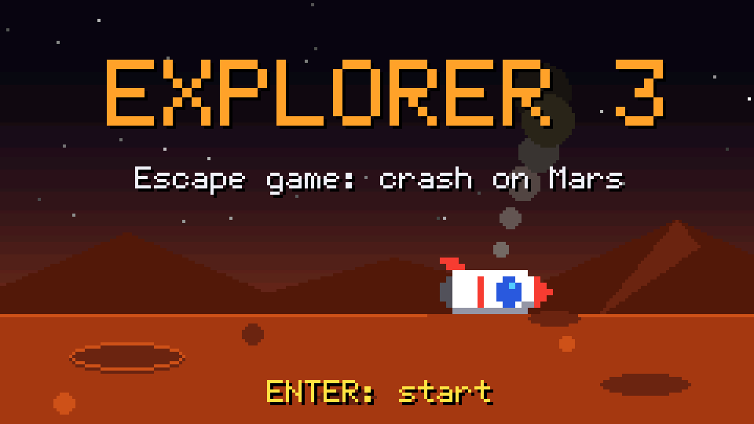

# Escape Game Cardputer : Explorer 3

**🇬🇧 [English version below](#english-version)**


Un mini escape game de 5 minutes pour le **M5Stack Cardputer ADV**, en français ou en anglais.

> Journal de bord, Sol 1 : notre vaisseau spatial **Explorer 3** s'est écrasé sur Mars.
> Pour redécoller, nous devons le réparer et retrouver son code de démarrage…
> avant la fin de la réserve d'oxygène !

## Le jeu

- **4 énigmes** à résoudre dans l'ordre. Chacune ouvre une partie du vaisseau et révèle une lettre du **code de démarrage** (4 lettres).
- **5 minutes d'oxygène.** Une jauge et un compte à rebours restent affichés en haut de l'écran, et une alarme « bip bip bip » accélère à mesure que l'oxygène baisse.
- **Chaque mauvaise réponse coûte 10 secondes** (« ACCÈS REFUSÉ »).
- Une fois le code retrouvé, on le tape sur l'ordinateur de bord pour lancer le **décollage** (animation et son), suivi d'un écran de fin en pixel art.
- Si l'oxygène tombe à zéro, la partie est perdue (écran « Oxygène épuisé »). On peut retenter immédiatement.
- Le **record** (oxygène restant à l'arrivée) reste en mémoire même après extinction.

### Les énigmes

| # | Lieu | Type d'énigme |
|---|------|---------------|
| 1 | Coffre du fer à souder | Un voyant clignote en **code Morse** |
| 2 | Réservoirs de carburant | Une question de **culture spatiale** (QCM) |
| 3 | Soute à pièces | Un **picross** (nonogramme) 5×5 |
| 4 | Ordinateur de bord | Un signal **Morse sonore** (l'alarme se tait pour qu'on l'entende) |

Les solutions ne sont pas données ici. ⚠️ **Joueurs : ne lisez pas le code source, il contient les réponses !**

## Commandes

| Touche | Action |
|--------|--------|
| `ENTRÉE` | Valider, continuer, démarrer, rejouer |
| Lettres | Répondre aux énigmes, taper le code |
| `ESPACE` | Revoir ou réécouter le signal Morse (énigmes 1 et 4) |
| `TAB` | Afficher l'alphabet Morse (énigmes 1 et 4), n'importe quelle touche le ferme |
| `;` `.` `,` `/` | Déplacer le curseur du picross (haut, bas, gauche, droite) |
| `ENTRÉE` (picross) | Allumer ou éteindre une case |
| `DEL` | Effacer une lettre du code |

### Pour le maître du jeu

Appuyer **3 fois de suite sur `Fn`** (moins de 0,8 s entre deux appuis) met la partie en **pause** : le chrono s'arrête, le son se coupe et l'énigme est masquée. Encore **3 fois `Fn`** pour reprendre.

### Langue

Au premier démarrage, le Cardputer demande la langue (français ou anglais). Elle est gardée en mémoire. Pour la changer : entrée **Langue / Language** du premier menu.

## Mode « Avec écran » : le jeu aussi sur un PC ou une télé

Au démarrage, choisir **Cardputer seul** ou **Avec écran** : l'écran du Cardputer est recopié en direct dans le navigateur d'un PC ou d'une télé, et **le son sort de cet écran** (le Cardputer reste muet). On joue toujours avec le clavier du Cardputer.

1. Choisir **Avec écran**, puis le Wi-Fi de la box et taper son mot de passe (mémorisé pour les fois suivantes).
   - **Pas de box ?** Choisir **Créer le réseau Explorer3** : le Cardputer crée son propre Wi-Fi (`Explorer3`, mot de passe `Explorer3`).
   - **Réseau masqué ?** Choisir **Autre réseau** et taper son nom.
2. Le Cardputer affiche un **QR code**, son adresse IP (par exemple `192.168.1.42`) et `explorer3.local`. Scanner le QR code avec un téléphone, ou ouvrir l'adresse dans le navigateur (Chrome, Edge, Firefox, Safari). Rien à installer.
   - Avec le réseau Explorer3, un premier QR code fait rejoindre le Wi-Fi ; dès qu'un appareil s'y connecte, le QR code de la page s'affiche. `TAB` passe de l'un à l'autre.
   - `explorer3.local` fonctionne sur PC, Mac et téléphone, mais pas sur la Ouya : utiliser l'adresse IP.
3. Cliquer une fois sur la page ou appuyer sur une touche pour **activer le son** (les navigateurs l'exigent). Double-clic, `F` ou `Entrée` : plein écran.
4. `ENTRÉE` sur le Cardputer pour lancer le jeu.

### Le clavier codé (à jouer en équipe)

En mode avec écran, le code de démarrage ne se tape pas en lettres : l'ordinateur de bord affiche un **clavier codé**, 9 symboles sur les touches `1` à `9` (♥ ☺ ♪ ☼…). Seule l'**équipe de l'écran** voit la **table de décodage** qui donne le symbole de chaque lettre (l'écran n'affiche plus la copie du Cardputer à ce moment-là). Le joueur du Cardputer dit une lettre, l'autre équipe lui décrit le symbole, et ainsi de suite.

- La table est mélangée à chaque partie.
- `1` à `9` : choisir un symbole, `DEL` : effacer, `ENTRÉE` : valider les 4 symboles (« CODE REFUSÉ » et −10 s si le code est faux).
- La page affiche aussi le chrono d'oxygène, le nombre de symboles déjà tapés et clignote en rouge à chaque erreur.
- Placer l'écran pour que le joueur du Cardputer ne le voie pas !

Bon à savoir :

- `` ` `` sur l'écran de connexion ou d'adresse : choisir un autre Wi-Fi.
- La liste des Wi-Fi s'affiche en deux temps : les réseaux trouvés d'abord, puis ceux qu'une seconde recherche, plus lente, a ajoutés. `R` relance la recherche.
- En cas d'échec, le Cardputer en donne la cause : mot de passe refusé, réseau introuvable ou réseau qui ne répond pas.
- Le Cardputer ne capte que le Wi-Fi 2,4 GHz. Les réseaux « invités » bloquent souvent les échanges entre appareils : dans ce cas, utiliser le réseau Explorer3.
- Si la page perd la connexion, elle se reconnecte toute seule ; la partie continue sur le Cardputer.

### Sur une télé avec une console Ouya

La page fonctionne aussi dans **Firefox 68** sur la Ouya (Android 4.1). Le navigateur d'origine de la Ouya ne convient pas : il ne connaît ni les WebSocket ni le son Web Audio.

1. Sur le PC, télécharger la dernière version de Firefox pour Android 4.1 sur le site de Mozilla : [`fennec-68.11.0.multi.android-arm.apk`](https://archive.mozilla.org/pub/mobile/releases/68.11.0/android-api-16/multi/fennec-68.11.0.multi.android-arm.apk) (en français, entre autres langues).
2. Sur la Ouya, autoriser les sources inconnues (Paramètres Android > Sécurité), puis installer l'APK :
   - par USB avec `adb install fennec-68.11.0.multi.android-arm.apk`,
   - ou en le servant depuis le PC sur le réseau local, en HTTP simple (le navigateur d'origine de la Ouya ne gère pas le HTTPS actuel). Par exemple `python -m http.server`, puis ouvrir `http://<adresse du PC>:8000` sur la Ouya.
3. Lancer Firefox (menu **MAKE > SOFTWARE**) et ouvrir l'adresse IP affichée par le Cardputer. L'ajouter aux favoris pour la retrouver facilement.
4. Une première touche de la manette active le son. Ensuite, `O` (vue par Firefox comme `Entrée`) ou un double-clic avec le pavé tactile de la manette passe en plein écran.
5. Si les bords de l'image sont coupés par la télé, régler la **marge** avec les flèches haut et bas (0 à 15 %, gardée pour les fois suivantes). On peut aussi ajouter `?marge=5` à la fin de l'adresse.

Pour éviter que la console se mette en veille, la page joue en boucle une petite vidéo invisible dès que le son est activé. Pour que l'adresse ne change pas d'une fois sur l'autre, réserver l'adresse IP du Cardputer dans la box.

## Installation

### Avec M5Launcher (carte SD)

1. Télécharger `Escape-Game-Explorer-3.bin` dans la page [Releases](../../releases) (français et anglais dans le même fichier).
2. Le copier dans le dossier `apps/` de la carte SD.
3. Sur le Cardputer, dans le menu SD de M5Launcher, choisir le fichier pour l'installer.

### Compiler soi-même

Le projet utilise [PlatformIO](https://platformio.org/) :

```
pio run                # compile
pio run -t upload      # compile et flashe par USB
```

- Plateforme `espressif32 @ 6.7.0` (Arduino core 2.0.x)
- Bibliothèques : M5Cardputer, M5Unified, M5GFX, WebSockets (links2004)
- Le jeu : `src/main.cpp`, ses textes en français et en anglais : `src/textes.h`, le mode avec écran (Wi-Fi, page web, flux écran et son) : `src/diffusion.cpp`
- Chaque version publiée (tag `v…`) est compilée par GitHub Actions, qui joint le `.bin` à la release.

### Simulateur PC

Le jeu tourne aussi dans une fenêtre sur PC, avec le vrai moteur graphique du Cardputer : pratique pour essayer un texte ou un écran sans flasher. Voir [sim/LISEZMOI.md](sim/LISEZMOI.md).

## Matériel

Développé pour le **Cardputer ADV** (ESP32-S3, sans PSRAM, haut-parleur intégré). Aucun accessoire n'est nécessaire.

## Documentation technique

Fonctionnement interne (architecture, mode avec écran, protocole, clavier codé…) : [docs/TECHNIQUE.md](docs/TECHNIQUE.md) (en anglais : [docs/TECHNICAL.md](docs/TECHNICAL.md)).

## Licence

[MIT](LICENSE)

---

## English version

**🇫🇷 [Version française plus haut](#escape-game-cardputer--explorer-3)**



A 5-minute mini escape game for the **M5Stack Cardputer ADV**, in English or French.

> Captain's log, Sol 1: our spaceship **Explorer 3** has crashed on Mars.
> To take off again, we must repair it and find its start-up code…
> before the oxygen runs out!

### The game

- **4 puzzles**, solved in order. Each one opens part of the ship and reveals one letter of the 4-letter **start-up code**.
- **5 minutes of oxygen.** A gauge and a countdown stay at the top of the screen, and a "beep beep beep" alarm gets faster as the oxygen runs low.
- **Each wrong answer costs 10 seconds** ("ACCESS DENIED").
- Once the code is found, type it on the on-board computer to launch the **liftoff** (animation and sound), followed by a pixel art end screen.
- If the oxygen reaches zero, the game is lost ("Out of oxygen" screen). You can try again right away.
- The **record** (oxygen left at the end) is kept in memory, even after power off.

#### The puzzles

| # | Place | Puzzle type |
|---|-------|-------------|
| 1 | Soldering iron safe | A light blinking in **Morse code** |
| 2 | Fuel tanks | A **space trivia** question (multiple choice) |
| 3 | Cargo hold | A 5×5 **picross** (nonogram) |
| 4 | On-board computer | An **audio Morse** signal (the alarm goes quiet so you can hear it) |

The solutions are not given here. ⚠️ **Players: don't read the source code, it contains the answers!**

### Controls

| Key | Action |
|-----|--------|
| `ENTER` | Confirm, continue, start, play again |
| Letters | Answer the puzzles, type the code |
| `SPACE` | Watch or listen to the Morse signal again (puzzles 1 and 4) |
| `TAB` | Show the Morse code chart (puzzles 1 and 4), any key closes it |
| `;` `.` `,` `/` | Move the picross cursor (up, down, left, right) |
| `ENTER` (picross) | Light up or switch off a cell |
| `DEL` | Erase a letter of the code |

#### For the game master

Press **`Fn` 3 times in a row** (less than 0.8 s between presses) to **pause** the game: the countdown stops, the sound is muted and the puzzle is hidden. Press **`Fn` 3 times** again to resume.

#### Language

On first start-up, the Cardputer asks for the language (French or English). It is kept in memory. To change it: **Langue / Language** entry of the first menu.

### "With a screen" mode: the game on a PC or TV too

At start-up, choose **Cardputer only** or **With a screen**: the Cardputer screen is mirrored live in the web browser of a PC or TV, and **the sound comes out of that screen** (the Cardputer stays silent). You still play with the Cardputer keyboard.

1. Choose **With a screen**, then your router's Wi-Fi and type its password (saved for next time).
   - **No router?** Choose **Create the Explorer3 network**: the Cardputer creates its own Wi-Fi (`Explorer3`, password `Explorer3`).
   - **Hidden network?** Choose **Other network** and type its name.
2. The Cardputer shows a **QR code**, its IP address (for example `192.168.1.42`) and `explorer3.local`. Scan the QR code with a phone, or open the address in the browser (Chrome, Edge, Firefox, Safari). Nothing to install.
   - With the Explorer3 network, a first QR code joins the Wi-Fi; as soon as a device connects to it, the page's QR code shows up. `TAB` switches between them.
   - `explorer3.local` works on PC, Mac and phones, but not on the Ouya: use the IP address there.
3. Click the page once or press a key to **enable sound** (browsers require it). Double-click, `F` or `Enter`: full screen.
4. `ENTER` on the Cardputer to start the game.

#### The coded keypad (team play)

In "with a screen" mode the start-up code is not typed in letters: the on-board computer shows a **coded keypad**, 9 symbols on keys `1` to `9` (♥ ☺ ♪ ☼…). Only the **screen team** sees the **decoding table** giving the symbol of each letter (at that moment the screen no longer shows the Cardputer). The Cardputer player says a letter, the other team describes the symbol, and so on.

- The table is shuffled every game.
- `1` to `9`: pick a symbol, `DEL`: erase, `ENTER`: confirm the 4 symbols ("CODE REJECTED" and −10 s if the code is wrong).
- The page also shows the oxygen countdown and how many symbols have been typed, and flashes red on each error.
- Place the screen so that the Cardputer player can't see it!

Good to know:

- `` ` `` on the connecting or address screen: choose another Wi-Fi network.
- The Wi-Fi list comes in two steps: the networks found first, then those added by a second, slower search. `R` searches again.
- When a connection fails, the Cardputer tells why: wrong password, network not found or network not responding.
- The Cardputer only supports 2.4 GHz Wi-Fi. "Guest" networks often block traffic between devices: use the Explorer3 network instead.
- If the page loses the connection, it reconnects by itself; the game goes on on the Cardputer.

#### On a TV with an Ouya console

The page also works in **Firefox 68** on the Ouya (Android 4.1). The Ouya's stock browser can't be used: it supports neither WebSocket nor Web Audio sound.

1. On the PC, download the last Firefox for Android 4.1 from Mozilla's site: [`fennec-68.11.0.multi.android-arm.apk`](https://archive.mozilla.org/pub/mobile/releases/68.11.0/android-api-16/multi/fennec-68.11.0.multi.android-arm.apk) (English among other languages).
2. On the Ouya, allow unknown sources (Android settings > Security), then install the APK:
   - over USB with `adb install fennec-68.11.0.multi.android-arm.apk`,
   - or by serving it from the PC on the local network over plain HTTP (the Ouya's stock browser can't handle today's HTTPS). For example `python -m http.server`, then open `http://<PC address>:8000` on the Ouya.
3. Start Firefox (**MAKE > SOFTWARE** menu) and open the IP address shown by the Cardputer. Bookmark it to find it again easily.
4. A first press on a gamepad button enables sound. After that, `O` (seen by Firefox as `Enter`) or a double-click with the gamepad's touchpad switches to full screen.
5. If the TV crops the edges of the picture, set the **margin** with the up and down arrows (0 to 15 %, kept for next time). You can also add `?marge=5` at the end of the address.

To keep the console from going to sleep, the page loops a tiny invisible video once sound is enabled. To keep the same address every time, reserve the Cardputer's IP address in your router.

### Installation

#### With M5Launcher (SD card)

1. Download `Escape-Game-Explorer-3.bin` from the [Releases](../../releases) page (English and French in the same file).
2. Copy it to the `apps/` folder of the SD card.
3. On the Cardputer, pick the file in the M5Launcher SD menu to install it.

#### Build it yourself

The project uses [PlatformIO](https://platformio.org/):

```
pio run                # build
pio run -t upload      # build and flash over USB
```

- Platform `espressif32 @ 6.7.0` (Arduino core 2.0.x)
- Libraries: M5Cardputer, M5Unified, M5GFX, WebSockets (links2004)
- The game: `src/main.cpp`, its French and English texts: `src/textes.h`, "with a screen" mode (Wi-Fi, web page, screen and sound stream): `src/diffusion.cpp`
- Each published version (`v…` tag) is built by GitHub Actions, which attaches the `.bin` to the release.

#### PC simulator

The game also runs in a window on a PC, with the Cardputer's real graphics engine: handy to try a text or a screen without flashing. See [sim/LISEZMOI.md](sim/LISEZMOI.md) (in French; the commands are the same).

### Hardware

Made for the **Cardputer ADV** (ESP32-S3, no PSRAM, built-in speaker). No accessory needed.

### Technical documentation

How it works inside (architecture, "with a screen" mode, protocol, coded keypad…): [docs/TECHNICAL.md](docs/TECHNICAL.md) (in French: [docs/TECHNIQUE.md](docs/TECHNIQUE.md)).

### License

[MIT](LICENSE)
