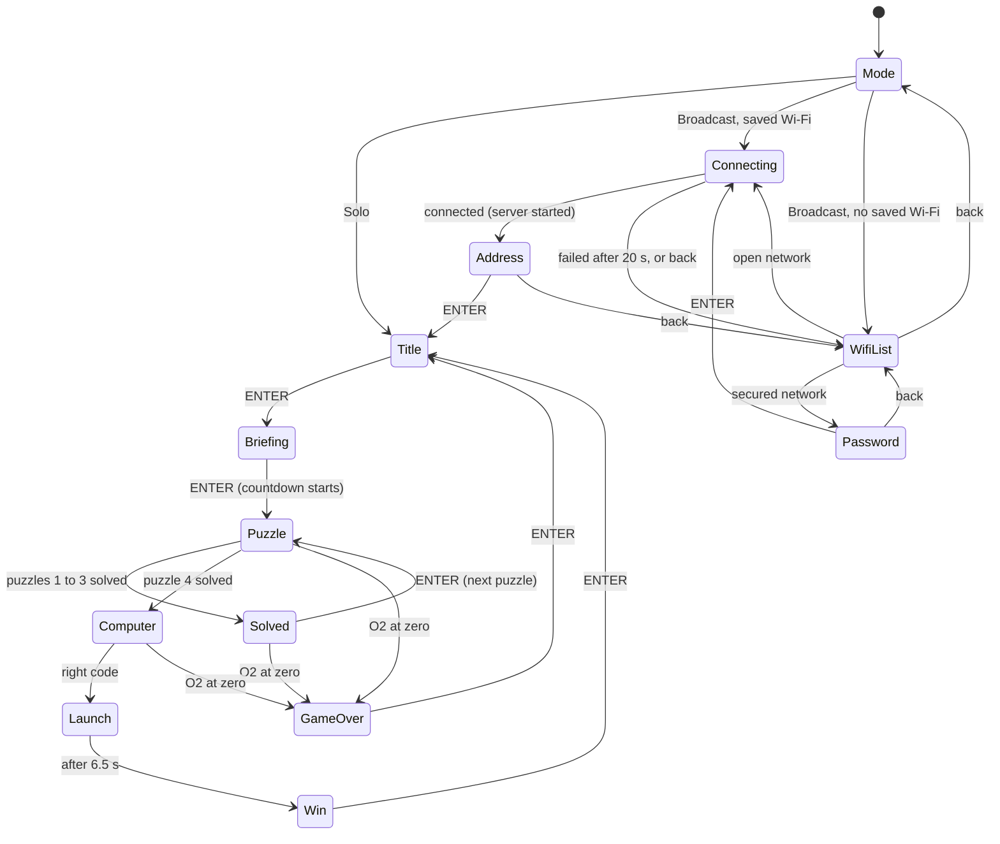
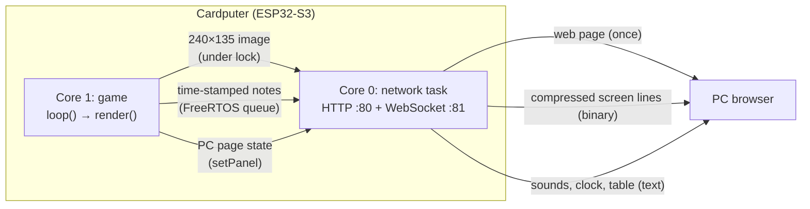

# Explorer 3: technical documentation

*Version française : [TECHNIQUE.md](TECHNIQUE.md).*

This document explains how the game works inside, for anyone who wants to build it, understand it or change it. It does not give the puzzle solutions, but they are in plain text in the source code.

Version described: **v1.4**.

## Contents

1. [Overview](#1-overview)
2. [Building and installing](#2-building-and-installing)
3. [Code layout](#3-code-layout)
4. [Main loop and state machine](#4-main-loop-and-state-machine)
5. [Countdown, penalties and pause](#5-countdown-penalties-and-pause)
6. [Sound](#6-sound)
7. [Puzzles](#7-puzzles)
8. [Cardputer ADV keyboard](#8-cardputer-adv-keyboard)
9. [Broadcast mode](#9-broadcast-mode)
10. [Coded keypad (asymmetric play)](#10-coded-keypad-asymmetric-play)
11. [Memory and performance](#11-memory-and-performance)
12. [Known limits and security](#12-known-limits-and-security)
13. [Changing the game](#13-changing-the-game)

## 1. Overview

| | |
|---|---|
| Hardware | M5Stack **Cardputer ADV**: ESP32-S3 (2 cores, 240 MHz), 8 MB flash, **no PSRAM**, 240×135 screen, ES8311 audio codec (mono), TCA8418 keyboard |
| Framework | Arduino (ESP32 core 2.0.x) through PlatformIO |
| Language | C++17 on the Cardputer, HTML/CSS/JavaScript for the broadcast mode web page |
| Files | `src/main.cpp` (the game), `src/diffusion.cpp` and `src/diffusion.h` (broadcast mode) |
| License | MIT |

A game lasts 5 minutes: 4 puzzles solved in order, each giving one letter of a 4-letter code that is typed on the on-board computer to launch the rocket.

Two modes are offered at start-up:

- **Solo**: everything happens on the Cardputer.
- **Broadcast**: the Cardputer joins the Wi-Fi network, serves a web page itself, and a PC browser shows a live copy of the screen. The sound comes out of the PC. At the end, the PC shows a secret table for the **coded keypad** (section 10).

## 2. Building and installing

### Environment

`platformio.ini` settings:

| Setting | Value |
|---|---|
| Platform | `espressif32 @ 6.7.0` (Arduino core 2.0.x) |
| Board | `esp32-s3-devkitc-1`, 8 MB flash, `default_8MB.csv` partitions (application up to 3.3 MB) |
| USB | `ARDUINO_USB_CDC_ON_BOOT=1`, `ARDUINO_USB_MODE=1` (serial port over native USB) |
| Libraries | `m5stack/M5Cardputer ^1.1.1`, `m5stack/M5Unified ^0.2.11`, `m5stack/M5GFX ^0.2.17`, `links2004/WebSockets ^2.6.1` (2.7.3 at the time of v1.4) |

```
pio run                # build
pio run -t upload      # build and flash over USB
```

The output file is `.pio/build/cardputer-adv/firmware.bin` (application image only, about 1.34 MB).

### Installing with M5Launcher

M5Launcher keeps applications on the SD card and installs one at a time. Copy the `.bin` to the `apps/` folder of the card, then pick it in the M5Launcher SD menu. GitHub releases provide `Escape-Game-Explorer-3.bin` (French, `main` branch) and `Escape-Game-Explorer-3-EN.bin` (English, `english` branch).

### Branches

- `main`: French version.
- `english`: same code, translated texts and comments. Every change is made on `main` first, then carried over to `english`.

## 3. Code layout

The whole game is in `src/main.cpp`, inside an anonymous namespace. Sections are separated by `// ------ name` comments:

| Section | Contents |
|---|---|
| Constants | Screen size, game length, penalty, Morse units, audio channels, colour palette (RGB565), Morse alphabet, pixel-art drawings (rocket, picross, symbols) |
| Keyboard reader | `PolledKeyboardReader` (section 8) |
| Global state | Current state, countdown, puzzle, typed input, pause, record, broadcast mode variables |
| sound | Note scheduler, sound effects, liftoff noise |
| countdown | `remaining()`, `fmtTime()`, `penalty()` |
| drawing | Primitives (text, shadowed text, word wrap, scenery, HUD, footer) |
| Morse, picross | Puzzle logic |
| screens | One `drawXxx()` per screen |
| coded keypad | Keypad generation, input, message to the PC (section 10) |
| logic | Transitions (`enter`, `startPuzzle`, `solvePuzzle`…), keyboard (`handleKey`), update (`update`), pause |
| `setup()` / `loop()` | Start-up and main loop |

`src/diffusion.cpp` holds everything network-related, behind the `mirror::` interface declared in `src/diffusion.h`. `main.cpp` includes neither Wi-Fi nor the servers.

### Drawing

The whole screen is drawn into a 240×135, 16-bit `M5Canvas` sprite (64,800 bytes), then sent to the display in one go with `pushSprite()`. There is no flicker, and broadcast mode can read the same image. The font is `efontJA_12`, chosen because it has the French accented letters (É, È, À…), unlike `efontCN_12`.

### Data kept in memory (NVS)

`Preferences` namespace `explorer3`:

| Key | Type | Contents |
|---|---|---|
| `best_o2` | uint | Record: largest O2 left at the end of a won game (ms) |
| `ssid`, `pass` | string | Last Wi-Fi network used in broadcast mode, saved only after a successful connection |

## 4. Main loop and state machine

### `loop()`

On every pass, roughly every 10 to 20 ms:

1. read the keyboard (`updateKeyList` then `updateKeysState`);
2. start notes whose time has come (`runNotes`);
3. on a newly pressed key: `Fn` alone goes to the pause counter, otherwise `handleKey()` (except while paused);
4. `update(now)` (except while paused): countdown, O2 alarm, timed steps, Wi-Fi follow-up;
5. in broadcast mode: `updatePanel(now)`, which sends the PC page state;
6. `render(now)` between `mirror::lockScreen()` and `mirror::unlockScreen()`;
7. `delay(10)`.

### States (`enum class St`)



| State | Screen | Notes |
|---|---|---|
| `Mode` | Solo / Broadcast choice | First screen after start-up |
| `WifiList`, `Password`, `Connecting`, `Address` | Broadcast mode setup | Section 9 |
| `Title` | Title (Mars, rocket lying on the ground) | |
| `Briefing` | Logbook | ENTER starts the countdown |
| `Puzzle` | Puzzle `puzzle` (0 to 3) | |
| `Solved` | Ship part repaired, letter obtained | |
| `Computer` | On-board computer, code entry | 5 text lines appear every 600 ms, then the code entry |
| `Launch` | Liftoff animation (6.5 s) | Countdown stopped, record saved |
| `Win` / `GameOver` | End screens | ENTER goes back to the title, the chosen mode is kept |

"back" = the `` ` `` key (backtick).

`enter(St)` changes the state and stores the time in `stateStart`, which drives animations and timed steps.

## 5. Countdown, penalties and pause

- A game lasts `GAME_MS` = 5 min. The countdown is based on an absolute deadline `deadline` (in `millis()`), and `remaining()` computes the time left.
- **Penalty** (`penalty()`): `deadline` moves back by `PENALTY_MS` = 10 s. The screen border flashes red for 0.4 s, "−10 s" shows for 1.5 s and the `errCount` counter goes up (used by the PC page).
- **HUD**: O2 gauge green above 50 %, orange above 20 %, red below. The time blinks under 1 minute. The code letter boxes fill up as puzzles are solved.
- **O2 alarm**: 3 beeps at 2 kHz, repeated every `1500 + 8500 × remaining / GAME_MS` ms, so from every 10 s at the start down to every 1.5 s at the end. It is muted during the two Morse puzzles.
- **Game master pause**: `Fn` pressed alone 3 times, with less than `FN_GAP_MS` = 800 ms between presses, during `Puzzle`, `Solved` or `Computer`. The time left is frozen in `pausedRemaining`, the sound is cut and the puzzle is hidden. On resume, `deadline` and `stateStart` are shifted by the length of the pause.
- **Record**: on a win, if the O2 left beats `best_o2`, it is saved and the screen shows "NEW RECORD!".

## 6. Sound

### Channels

The M5Unified speaker mixes several virtual channels:

| Channel | Use |
|---|---|
| `CH_O2` (0) | Oxygen alarm |
| `CH_SFX` (1) | Clicks, error, success, defeat, terminal |
| `CH_MORSE` (2) | Audio Morse signal |
| `CH_RUMBLE` (3) | Liftoff rumble (noise) |
| `CH_WHISTLE` (4) | Rising liftoff whistle |

### Note scheduler

`schedule(at, freq, dur, ch)` stores a note in a fixed 64-slot array (`notes[]`). `runNotes(now)`, called twice per loop pass, plays the notes whose time has passed. A sound effect or a Morse signal is therefore a series of time-stamped notes, with no `delay()`. `cancelChannel(ch)` cancels a channel's pending notes and stops it, `stopAllSound()` does the same for all channels.

This is the **only place** sound comes out, which lets broadcast mode send it to the PC instead of the speaker (section 9.5):

- `runNotes` calls `Speaker.tone()` in solo, and `mirror::sendTone()` in broadcast;
- `cancelChannel` and `stopAllSound` call `Speaker.stop()` in solo, and `mirror::sendStop()` in broadcast;
- `channelPlaying(ch)` replaces `Speaker.isPlaying(ch)`. In broadcast it relies on `chanUntil[ch]`, the end time of the current note, since the speaker plays nothing.

### Liftoff

At start-up, `buildNoise()` computes 1 s of brown noise at 8 kHz (`noiseBuf`, 16 KB), with a few crackles and a crossfade so it loops without a click. During `Launch`, the `CH_RUMBLE` channel volume rises from 0 to 255 in 1.5 s, stays at the maximum until 5 s, then falls back to 0 at 6.5 s. The whistle (40 notes from 120 to 978 Hz) follows the same envelope at 70/255.

## 7. Puzzles

The mechanisms are described here, not the answers.

| # | Mechanism | Code |
|---|---|---|
| 1 | A light blinks a letter in Morse (unit `LAMP_UNIT_MS` = 400 ms); the player types the letter | `startMorseLamp()`, `lampOn()` |
| 2 | Multiple-choice question with 4 answers (A to D) | `drawPuzzleQuiz()` |
| 3 | 5×5 picross; row and column clues are computed from the `PICROSS[]` pattern | `buildClues()`, `lineClues()`, `picrossSolved()` |
| 4 | Audio Morse signal, 700 Hz, unit `SOUND_UNIT_MS` = 200 ms; the player types the letter | `startMorseSound()` |

- `TAB` shows the Morse alphabet (`drawMorseHelp()`), `SPACE` replays the signal.
- A wrong letter triggers `penalty()`. A right letter calls `solvePuzzle()`.
- The picross is solved when the grid is **identical** to the pattern (`picrossSolved()`). A row's or column's clues turn green as soon as it matches them (`rowOk()`, `colOk()`).

## 8. Cardputer ADV keyboard

The ADV keyboard is a TCA8418 controller on I²C, which signals its events with an interrupt on GPIO11. The M5Cardputer 1.1.1 library reader only reads the controller once that interrupt has fired. If a key arrives at the wrong moment, the interrupt is lost, the line stays low and the keyboard stops responding entirely, while the game keeps running.

`PolledKeyboardReader` replaces that reader: on every loop pass, it empties the TCA8418 event queue (`getEvent()` until 0), without relying on the interrupt. It produces the same key list as the library. It is installed in `setup()` with `M5Cardputer.begin(cfg, false)` then `Keyboard.begin(std::unique_ptr<KeyboardReader>(...))`, only when the detected board is a Cardputer ADV.

## 9. Broadcast mode

### 9.1 How it works



Nothing needs to be installed on the PC: the Cardputer serves the page itself (`http://<address>/`) and then pushes everything over WebSocket. The game runs alone on core 1, the network task on core 0, so the game never blocks on Wi-Fi.

### 9.2 `mirror::` interface (`diffusion.h`)

| Function | Role |
|---|---|
| `startScan()`, `scanDone(out)` | Asynchronous Wi-Fi scan; `scanDone` returns `true` once it is over, with a de-duplicated list sorted by signal strength |
| `connect(ssid, pass)`, `connected()` | Station-mode connection, host name `explorer3` |
| `address()` | `"http://" + local IP` |
| `startServer(screen, w, h)` | Starts the web page, the WebSocket and the network task, given the address of the screen buffer. A second call only turns Wi-Fi power saving off again. |
| `clientCount()` | Number of connected browsers (shows "PC connected") |
| `lockScreen()`, `unlockScreen()` | Lock (FreeRTOS mutex) around drawing; does nothing until the server is started |
| `sendTone()`, `sendStop()`, `sendRumble()` | Sounds to play on the PC (section 9.5) |
| `setPanel(text)` | State of the PC-only page (section 10) |

### 9.3 Wi-Fi setup

These screens are game states (`WifiList`, `Password`, `Connecting`, `Address`) and are drawn in the same sprite as the rest:

- scanning and connecting are **non-blocking**, and `update()` watches `scanDone()` and `connected()`;
- no connection after `WIFI_TIMEOUT_MS` = 20 s: back to the list with an error message;
- the password is shown in clear while typing;
- the network is saved to NVS **after** a successful connection;
- `WiFi.setSleep(false)` turns off Wi-Fi power saving, which would otherwise cause stutters of 100 ms or more.

### 9.4 Image stream

**Picking lines.** Every `FRAME_MS` = 40 ms (at most 25 frames/s), and only when a browser is connected, the network task takes the screen lock and computes a 32-bit hash for each line (an FNV-1a variant over 32-bit words, forced odd so it is never 0). Only lines whose hash changed are sent. A hash of 0 forces a resend: that is what happens each time a new browser connects.

**Line encoding**, whichever of the two is shorter:

```
[y: 1 byte][0][240 pixels × 2 bytes]                 raw
[y: 1 byte][1][n: 1 byte][colour: 2 bytes]...        runs, n = 1..255, up to 240 pixels
```

Colours are RGB565, high byte first, in the sprite's memory order. A binary message holds a series of lines and is at most `FRAME_BUF` = 12 KB. If a frame doesn't fit, the rest goes on the next pass: it resumes at line `nextRow`, so the bottom of the screen isn't always served last. A full game screen usually weighs 5 to 10 KB instead of 65 KB.

**Display.** The page decodes the lines into a 240×135 `ImageData` and draws it into a `<canvas>` on each `requestAnimationFrame`. The canvas is scaled up in CSS (16:9 ratio, `image-rendering: pixelated`) to keep sharp pixels.

### 9.5 Sound on the PC

Sound is sent as commands, not audio: a few bytes per note. Every text message starts with the Cardputer time when it was sent:

| Message | Meaning |
|---|---|
| `P,now` | Clock only, every 250 ms |
| `T,now,at,frequency,duration,channel` | Play a note at time `at` (Cardputer ms) |
| `S,now,at,channel` | Stop a channel at time `at` (`255` = all) |
| `R,now,at` | Start the liftoff rumble at time `at` |
| `K,now,...` | PC page state (section 10) |

**Synchronisation.** For each message, the page computes `performance.now() − now`. It keeps the smallest value of the last 40 messages: that is the measurement least delayed by the network. A note due at time `at` is played by Web Audio at `at + offset + LAT`, with `LAT` = 150 ms of margin. Wi-Fi delay variations are absorbed and the Morse rhythm stays exact. The trade-off is that the sound lags by about 0.15 s.

**Synthesis.** Notes are sine oscillators, like the M5Unified default waveform, with 3 ms ramps to avoid clicks. A new note cuts the previous one on the same channel. The rumble is brown noise computed by the page, looped with the same envelope as on the Cardputer. The whistle follows that envelope at 70/255. Master volume is 0.3.

Browsers forbid sound before a user action. The audio context is therefore created on the first click on the page ("Click to enable sound"). Before that click, sound messages are ignored, but the clock is still tracked.

### 9.6 Network task

`netTask` is pinned to core 0, with priority 1 and a 6 KB stack. It loops over:

1. `http.handleClient()` and `ws.loop()`;
2. sending pending sounds (64-entry FreeRTOS queue, filled by the game without waiting);
3. sending the PC page state if it changed;
4. the clock every 250 ms;
5. the image every 40 ms;
6. `vTaskDelay(1)`.

On the page side, a lost connection is retried every second. A new browser receives the full screen and the current state of its page. Several browsers can be open at the same time.

## 10. Coded keypad (asymmetric play)

It only exists in broadcast mode. It replaces typing the code in letters on the on-board computer with a two-team game: the Cardputer player sees symbols, the PC team sees the matching table.

### Generation (`buildKeypad()`, on entering `Computer`)

- 9 symbols drawn at random from 12 (`SYMBOLS[]`) and spread over keys `1` to `9` (`keySym[]`);
- 9 letters: the 3 distinct letters of the code and 6 other random letters, spread randomly over those keys (`keyLetter[]`);
- the 12 symbols, inspired by the Alt codes of code page 437, are drawn as 12×12 pixel art (scaled ×2 on the keypad): ☺ ♥ ♦ ♣ ♠ ♂ ♀ ♪ ☼ ⌂ ▲ ‼. ☻ and ♫ were left out as too close to ☺ and ♪.

### Input

The keypad appears 600 ms after the last terminal line (`keypadShown()`). `typedCode` stores the typed keys (`'1'` to `'9'`). DEL erases the last one. ENTER, once 4 keys are typed, compares `keypadCode()` (the letters of those keys) with the code: if it matches, the rocket lifts off; otherwise the input is cleared and `penalty()` is called.

### PC page (`updatePanel()` then `mirror::setPanel()`)

| Text | Effect on the page |
|---|---|
| `0` | Copy of the Cardputer screen |
| `1,remaining_ms,typed,errors,table` | Table instead of the copy |

- The table is a series of pairs `letter` + `symbol number in hexadecimal` (`0` to `b`), sorted by letter.
- The page shows the 9 cells, the O2 countdown and 4 boxes that fill up according to `typed` (without telling which symbols were typed). It flashes red when `errors` changes.
- The countdown is recomputed locally every 100 ms from `remaining_ms` and the clock, so it runs smoothly.
- The game sends the state again on each change, and every 500 ms while the table is shown. During the pause and as soon as `Computer` is left, it sends `0`.
- On the PC, the symbols are Unicode characters followed by U+FE0E (text presentation) with the "Segoe UI Symbol" font, to avoid colour emoji.

## 11. Memory and performance

Figures measured on v1.4:

| Item | Size |
|---|---|
| Program | ~1.34 MB out of 3.3 MB (40 %) |
| Static RAM | ~69 KB out of 320 KB (21 %), including the liftoff noise (16 KB) |
| Screen sprite (heap) | 64,800 bytes |
| Broadcast mode (heap) | 12 KB send buffer, 6 KB network task stack, ~1 KB sound queue, plus the Wi-Fi and lwIP stack |
| Image bandwidth | 5 to 10 KB per full screen, much less when little moves; at most 25 frames/s |
| Latency | Image: one network task pass plus Wi-Fi, usually under 100 ms. Sound: about 150 ms, on purpose. |

Without PSRAM, large allocations must be avoided: no second full-screen sprite and no full frame buffer. That is why the image is sent line by line, with hashes instead of a copy of the previous frame.

## 12. Known limits and security

- **2.4 GHz Wi-Fi only** (ESP32-S3 limit). "Guest" networks and client isolation block the page.
- **No encryption and no authentication**: the page is plain HTTP and any device on the local network can open it. Fine for a game at home, to avoid on a public network.
- **The Wi-Fi password is stored in clear** in the Cardputer NVS.
- The IP address is only shown when connecting. To see it again, restart and choose Broadcast again.
- The send buffer is allocated when the server starts, without a failure check. Not a problem with current memory use, but worth watching if the game grows.
- In broadcast mode the Cardputer is silent: if nobody clicks "enable sound" on the PC, the game is played without sound.

## 13. Changing the game

- **Change the game length or penalty**: `GAME_MS`, `PENALTY_MS`.
- **Add a screen**: add a value to `St`, a `drawXxx()` function, its `case` in `render()` and, if needed, in `handleKey()` and `update()`.
- **Add a symbol to the coded keypad**: add a 12×12 drawing to `SYMBOLS[]` and increase `SYM_COUNT`. Add the character at the **same position** in the page's `SYM` array (in `diffusion.cpp`). Beyond 16 symbols, a single hexadecimal digit is not enough and the table format must change.
- **Change the PC page**: it is entirely in the `PAGE` string of `diffusion.cpp` (HTML, CSS and JavaScript in one block).
- **Translate**: change the texts on `main`, then carry the change over to the `english` branch, translating texts, comments and the page.
- **After a UI change**, check that no text goes off the 240×135 screen, and use `fit()` for variable-length texts such as Wi-Fi network names.
