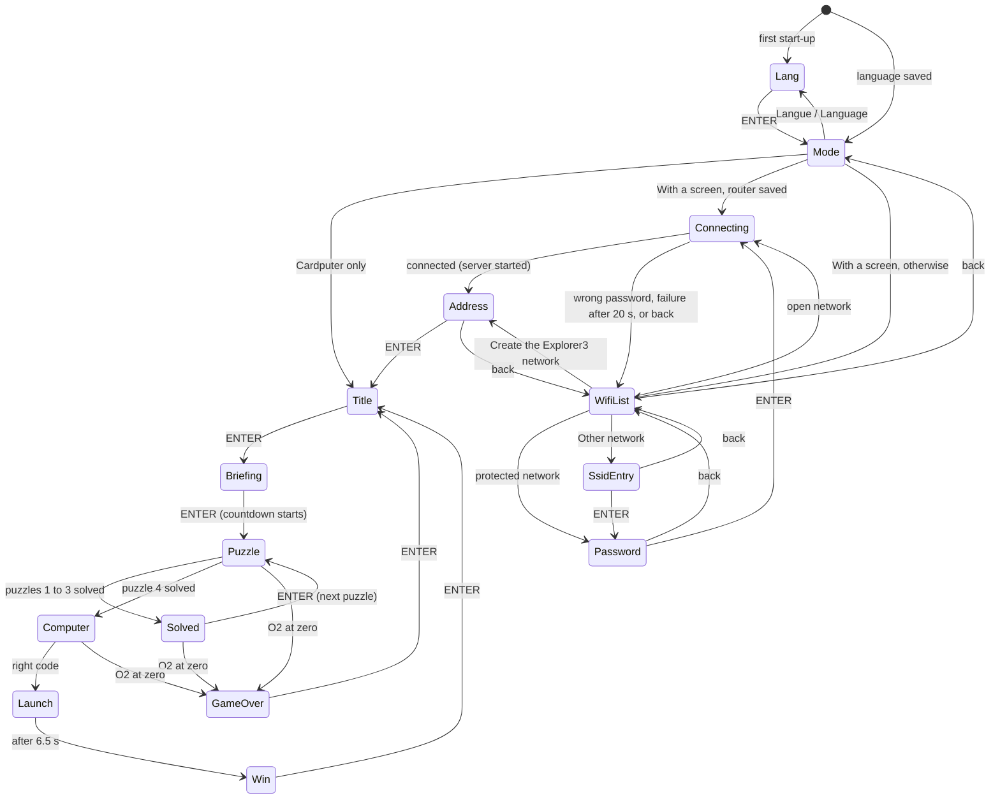
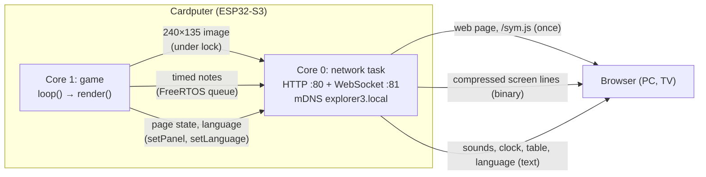

# Explorer 3: technical documentation

*Version française : [TECHNIQUE.md](TECHNIQUE.md).*

This document describes how the game works inside, for anyone who wants to build, understand or change it. It does not give the puzzle solutions, but they are in plain text in the source code.

Version described: **v1.5** (in preparation): game in French and English, Explorer3 network, QR codes, Firefox 68 and Ouya console support, PC simulator.

## Contents

1. [Overview](#1-overview)
2. [Building and installing](#2-building-and-installing)
3. [Code layout](#3-code-layout)
4. [Main loop and state machine](#4-main-loop-and-state-machine)
5. [Countdown, penalties and pause](#5-countdown-penalties-and-pause)
6. [Sound](#6-sound)
7. [Puzzles](#7-puzzles)
8. [Cardputer ADV keyboard](#8-cardputer-adv-keyboard)
9. ["With a screen" mode](#9-with-a-screen-mode)
10. [Coded keypad (asymmetric play)](#10-coded-keypad-asymmetric-play)
11. [Memory and performance](#11-memory-and-performance)
12. [Known limits and security](#12-known-limits-and-security)
13. [Changing the game](#13-changing-the-game)
14. [PC simulator](#14-pc-simulator)

## 1. Overview

| | |
|---|---|
| Hardware | M5Stack **Cardputer ADV**: ESP32-S3 (2 cores, 240 MHz), 8 MB flash, **no PSRAM**, 240×135 screen, ES8311 audio codec (mono), TCA8418 keyboard |
| Framework | Arduino (ESP32 core 2.0.x) through PlatformIO |
| Language | C++17 on the Cardputer, HTML/CSS/JavaScript for the "with a screen" web page |
| Files | `src/main.cpp` (the game), `src/textes.h` (French and English texts), `src/diffusion.cpp` and `src/diffusion.h` ("with a screen" mode), `sim/` (PC simulator) |
| License | MIT |

The game lasts 5 minutes: 4 puzzles solved in order, each one gives one letter of a 4-letter code to type on the on-board computer to launch the rocket.

The game is in **French or English**, chosen on first start-up (section 3). Two modes are then offered:

- **Cardputer only**: everything happens on the Cardputer.
- **With a screen**: the Cardputer joins the router's Wi-Fi (or creates its own, Explorer3), serves a web page itself, and the browser of a PC or TV shows a live copy of the screen. The sound comes out of that screen. At the end, the screen shows a secret table for the **coded keypad** (section 10).

## 2. Building and installing

### Environment

`platformio.ini` settings (environment `cardputer-adv`, the default one):

| Setting | Value |
|---|---|
| Platform | `espressif32 @ 6.7.0` (Arduino core 2.0.x) |
| Board | `esp32-s3-devkitc-1`, 8 MB flash, `default_8MB.csv` partitions (application up to 3.3 MB) |
| USB | `ARDUINO_USB_CDC_ON_BOOT=1`, `ARDUINO_USB_MODE=1` (serial port over native USB) |
| Libraries | `m5stack/M5Cardputer ^1.1.1`, `m5stack/M5Unified ^0.2.11`, `m5stack/M5GFX ^0.2.17`, `links2004/WebSockets ^2.6.1` (versions used for v1.5: 1.1.1, 0.2.25, 0.2.32 and 2.7.3) |

```
pio run                # build
pio run -t upload      # build and flash over USB
pio run -e simulateur  # PC simulator (section 14)
```

The output file is `.pio/build/cardputer-adv/firmware.bin` (application image only, about 1.39 MB), with both languages.

### Installing with M5Launcher

M5Launcher keeps applications on the SD card and installs one at a time. Copy the `.bin` to the `apps/` folder of the card, then pick it in the M5Launcher SD menu. GitHub releases provide `Escape-Game-Explorer-3.bin`.

### Automatic release

`.github/workflows/release.yml`: for every `v…` tag pushed to GitHub (for example `v1.5`), GitHub Actions builds the `cardputer-adv` environment, renames the firmware to `Escape-Game-Explorer-3.bin` and attaches it to the tag's release. If the release does not exist yet, it is created with notes generated from the commits. Libraries are cached from one build to the next.

```
git tag v1.5
git push origin v1.5
```

### Branches

A single branch, `main`, with both languages. The old `english` branch is no longer needed.

## 3. Code layout

The whole game is in `src/main.cpp`, inside an anonymous namespace. Sections are separated by `// ------ name` comments:

| Section | Content |
|---|---|
| Constants | Screen size, game length, penalty, Morse units, audio channels, colour palette (RGB565), Morse alphabet, pixel art drawings (rocket, picross, symbols) |
| Keyboard reader | `PolledKeyboardReader` (section 8) |
| Global state | Current state, language, countdown, puzzle, input, pause, record, "with a screen" variables |
| sound | Note scheduler, sound effects, liftoff noise |
| countdown | `remaining()`, `fmtTime()`, `penalty()` |
| drawing | Primitives (text, shadowed text, word wrap, scenery, HUD, footer) |
| Morse, picross | Puzzle logic |
| screens | One `drawXxx()` per screen |
| coded keypad | Keypad generation, input, symbol drawings for the web page, message to the screen (section 10) |
| logic | Transitions (`enter`, `startPuzzle`, `solvePuzzle`…), keyboard (`handleKey`), update (`update`), pause |
| `setup()` / `loop()` | Start-up and main loop |

`src/diffusion.cpp` holds everything network related, behind the `mirror::` interface declared in `src/diffusion.h`. `main.cpp` includes neither Wi-Fi nor the servers.

### Texts and languages (`src/textes.h`)

Every displayed text is a `{ French, English }` pair of type `Tx`, grouped by screen:

```cpp
constexpr Tx P2_FOOTER = {"Répondez A, B, C ou D", "Answer A, B, C or D"};
...
drawFooter(tr(P2_FOOTER));
```

`tr()` returns the text in the current language (`lang`: 0 French, 1 English). Both translations sit side by side, so none gets forgotten. The web page texts are in the page itself (section 9.7).

**Keys.** In the texts, a hint is written "key: action" (`"ENTER: confirm"`): `hint()` and `drawFooter()` draw what comes before the first `:` in orange and the rest in the text colour. The Cardputer arrows (keys `;` `.` `,` `/`) are written `K_UP`, `K_DOWN`, `K_LEFT`, `K_RIGHT` (codes 1 to 4) and drawn as 9 px orange triangles. In a footer, `|` separates the groups, which `drawFooter()` spreads across the width (6 to 24 px apart). Back is written `ESC`.

**Room on screen.** The `efontJA_12` font is 6 px per Latin character, accents included, so 40 characters across 240 px. In practice all the groups of a footer must stay under about 230 px (width minus the minimum gaps), and narrow columns (picross, coded keypad, address screen) wrap with `wrapped()`. The simulator (section 14) shows every screen for checking.

### Drawing

The whole screen is drawn into a 240×135, 16-bit `M5Canvas` sprite (64,800 bytes), then sent to the display in one go with `pushSprite()`. So there is no flicker, and "with a screen" mode can read this same image. The font is `efontJA_12`, chosen because it has French accented letters (É, È, À…), unlike `efontCN_12`.

### Data kept in memory (NVS)

`Preferences` namespace `explorer3`:

| Key | Type | Content |
|---|---|---|
| `lang` | uchar | Language (0 French, 1 English). Missing on first start-up: the language screen is shown |
| `best_o2` | uint | Record: largest O2 reserve left on winning (ms) |
| `ssid`, `pass` | string | Last router Wi-Fi used, saved only after a successful connection |
| `auto` | bool | `true`: "With a screen" reconnects directly to `ssid`. Set to `false` when the Explorer3 network is created, so the Wi-Fi list is shown next time. Missing = `true` |

## 4. Main loop and state machine

### `loop()`

On each pass, about every 10 to 20 ms:

1. read the keyboard (`updateKeyList` then `updateKeysState`);
2. start the notes that are due (`runNotes`);
3. newly pressed key: `Fn` alone goes to the pause counter, otherwise `handleKey()` (unless paused);
4. `update(now)` (unless paused): countdown, O2 alarm, timed transitions, Wi-Fi search and connection;
5. in "with a screen" mode: `updatePanel(now)`, which sends the state of the screen page;
6. `render(now)` between `mirror::lockScreen()` and `mirror::unlockScreen()`;
7. `delay(10)`.

### States (`enum class St`)



| State | Screen | Notes |
|---|---|---|
| `Lang` | Langue / Language | On first start-up, then from the mode choice |
| `Mode` | Cardputer only / With a screen / Language | |
| `WifiList`, `SsidEntry`, `Password`, `Connecting`, `Address` | "With a screen" setup | Section 9.3 |
| `Title` | Title (Mars, rocket on its side) | |
| `Briefing` | Captain's log | ENTER starts the countdown |
| `Puzzle` | Puzzle `puzzle` (0 to 3) | |
| `Solved` | Ship part repaired, letter engraved on it | |
| `Computer` | On-board computer, code input | 5 lines of text appear every 600 ms, then the input |
| `Launch` | Liftoff animation (6.5 s) | Countdown stopped, record saved |
| `Win` / `GameOver` | End screens | ENTER goes back to the title, the chosen mode is kept |

"back" = `ESC` (the Cardputer `` ` `` key, checked with `` hasChar(ks, '`') ``).

`enter(St)` changes state and stores the time in `stateStart`, used by animations and timed transitions.

## 5. Countdown, penalties and pause

- The game lasts `GAME_MS` = 5 min. The countdown is based on an absolute deadline `deadline` (in `millis()`), and `remaining()` computes the time left.
- **Penalty** (`penalty()`): `deadline` moves back by `PENALTY_MS` = 10 s. The screen border flashes red for 0.4 s, "−10 s" shows for 1.5 s and the `errCount` counter goes up (used by the screen page). The wrong letter is shown with "ACCESS DENIED" (puzzles 1, 2 and 4), a wrong code with "CODE REJECTED" for 1.5 s (`codeRefusedUntil`).
- **HUD**: O2 gauge green above 50 %, orange above 20 %, red below. The time blinks under 1 minute. The code letter boxes fill up as puzzles are solved.
- **O2 alarm**: 3 beeps at 2 kHz, repeated every `1500 + 8500 × remaining / GAME_MS` ms, so from every 10 s at the start to every 1.5 s at the end. It goes quiet during both Morse puzzles.
- **Game master pause**: `Fn` pressed alone 3 times, less than `FN_GAP_MS` = 800 ms apart, during `Puzzle`, `Solved` or `Computer`. The time left is frozen in `pausedRemaining`, the sound is cut and the puzzle hidden. On resume, `deadline` and `stateStart` are shifted by the pause length.
- **Record**: on winning, if the O2 left beats `best_o2`, it is saved and the screen shows "NEW RECORD!".

## 6. Sound

### Channels

The M5Unified speaker mixes several virtual channels:

| Channel | Use |
|---|---|
| `CH_O2` (0) | Oxygen alarm |
| `CH_SFX` (1) | Clicks, error, success, defeat, terminal |
| `CH_MORSE` (2) | Audio Morse signal |
| `CH_RUMBLE` (3) | Liftoff rumble (noise) |
| `CH_WHISTLE` (4) | Rising liftoff whistle |

### Note scheduler

`schedule(at, freq, dur, ch)` stores a note in a fixed 64-slot array (`notes[]`). `runNotes(now)`, called twice per loop pass, plays the notes whose time has come. A sound effect or a Morse signal is therefore a series of timed notes, with no `delay()`. `cancelChannel(ch)` cancels the pending notes of a channel and stops that channel, `stopAllSound()` does the same for all.

This is the **only place** sound comes out, which lets "with a screen" mode send it to the browser instead of the speaker (section 9.5):

- `runNotes` calls `Speaker.tone()` on the Cardputer only, and `mirror::sendTone()` with a screen;
- `cancelChannel` and `stopAllSound` call `Speaker.stop()` on the Cardputer only, and `mirror::sendStop()` with a screen;
- `channelPlaying(ch)` replaces `Speaker.isPlaying(ch)`. With a screen it relies on `chanUntil[ch]`, the end time of the current note, since the speaker plays nothing.

### Liftoff

`buildNoise()` computes at start-up 1 s of brown noise at 8 kHz (`noiseBuf`, 16 KB), with a few crackles and a crossfade so it loops without a click. During `Launch`, the `CH_RUMBLE` volume rises from 0 to 255 in 1.5 s, stays at the top until 5 s, then falls back to 0 at 6.5 s. The whistle (40 notes from 120 to 978 Hz) follows the same envelope at 70/255.

## 7. Puzzles

The mechanisms are described here, not the answers.

| # | Mechanism | Code |
|---|---|---|
| 1 | A light blinks a letter in Morse (unit `LAMP_UNIT_MS` = 400 ms); type the letter | `startMorseLamp()`, `lampOn()` |
| 2 | Multiple choice with 4 answers (A to D) | `drawPuzzleQuiz()` |
| 3 | 5×5 picross in the cargo hold; row and column clues are computed from the `PICROSS[]` pattern | `buildClues()`, `lineClues()`, `picrossSolved()` |
| 4 | Audio Morse signal, 700 Hz, unit `SOUND_UNIT_MS` = 200 ms; type the letter | `startMorseSound()` |

- `TAB` shows the Morse code chart (`drawMorseHelp()`), any key closes it, `SPACE` plays the signal again ("watch again" for the light, "listen again" for the sound).
- A wrong letter triggers `penalty()`. A right letter calls `solvePuzzle()`.
- The picross is solved when the grid is **identical** to the pattern (`picrossSolved()`). Lit cells are orange on a dark background; the clues of a row or column turn green as soon as it matches them (`rowOk()`, `colOk()`).

## 8. Cardputer ADV keyboard

The ADV keyboard is a TCA8418 controller on I²C, which signals its events through an interrupt on GPIO11. The reader of the M5Cardputer 1.1.1 library only reads the controller once that interrupt has arrived. If a key comes at the wrong moment, the interrupt is lost, the line stays low and the keyboard stops responding entirely, while the game keeps running.

`PolledKeyboardReader` replaces that reader: on every loop pass it empties the TCA8418 event queue (`getEvent()` until 0), without relying on the interrupt. It produces the same key list as the library. It is installed in `setup()` with `M5Cardputer.begin(cfg, false)` then `Keyboard.begin(std::unique_ptr<KeyboardReader>(...))`, only when the detected board is a Cardputer ADV.

## 9. "With a screen" mode

### 9.1 How it works



The screen has nothing to install: the Cardputer serves the page itself (`http://<address>/`) then pushes everything over WebSocket. The game runs alone on core 1, the network task on core 0. So the game never blocks on Wi-Fi.

### 9.2 `mirror::` interface (`diffusion.h`)

| Function | Role |
|---|---|
| `startScan()`, `pollScan(out)` | Two-pass, non-blocking Wi-Fi search (section 9.3). `pollScan` returns `Running`, `Partial` (first list), `Done` (full list) or `Failed` |
| `connect(ssid, pass)`, `link()`, `failure()`, `attempt()` | Router connection, host name `explorer3`. `link()`: `Connecting`, `Connected` or `BadPassword`; `failure()`: likely cause after the timeout (`NotFound` or `NoAnswer`); `attempt()`: number of the current attempt |
| `startAccessPoint()`, `accessPoint()`, `apClients()`, `wifiQrText()` | Explorer3 network created by the Cardputer (section 9.3) |
| `ipAddress()` | IP address on the router or on Explorer3 (`192.168.4.1`) |
| `startServer(screen, w, h)` | Starts the web page, the WebSocket, the network task and announces `explorer3.local`, given the address of the screen buffer. Returns `false` without starting anything if memory runs out. A second call (network change) announces the mDNS name again and turns Wi-Fi power saving off |
| `clientCount()` | Number of connected browsers (shows "Browser connected") |
| `lockScreen()`, `unlockScreen()` | Lock (FreeRTOS mutex) around drawing; does nothing until the server has started |
| `sendTone()`, `sendStop()`, `sendRumble()` | Sounds for the browser to play (section 9.5) |
| `setPanel(text)` | State of the screen team's page (section 10) |
| `setLanguage(lang)` | Page language (section 9.7) |
| `setSymbols(js)` | Symbol drawings served as `/sym.js` (section 10) |
| `AP_SSID`, `AP_PASS`, `HOST_NAME` | `Explorer3`, `Explorer3`, `explorer3.local` |

### 9.3 Wi-Fi setup

These screens are game states (`WifiList`, `SsidEntry`, `Password`, `Connecting`, `Address`) and are drawn into the same sprite as everything else. Everything is **non-blocking**: `update()` polls `pollScan()` and `link()` on every pass.

**Wi-Fi list.** At the top, "Create the Explorer3 network"; then the networks found, sorted by signal, with a padlock for protected networks and 4 signal bars (−60, −70, −78 dBm); last, "Other network (type its name)" for a hidden network. `R` searches again. An error message is cleared as soon as you move in the list.

**Two-pass search.** Earlier versions often showed "No network found" by mistake: a driver refusal or a timeout was taken for an empty list. The search is now a small state machine in `diffusion.cpp`:

1. `startScan()` switches back to station mode (stopping the Explorer3 network if it was running), interrupts a connection attempt (`WiFi.disconnect()`) and clears the list.
2. **Active pass** (`scanNetworks(async, …, 400 ms per channel)`): routers answer a request. At the end, `pollScan` returns `Partial` and the list is shown.
3. **Passive pass** (300 ms per channel): listens to beacons, for routers that answer requests poorly. Its networks are added to the list (no duplicates, best signal kept), which updates without losing the selection. Three animated dots after the title show it is running.
4. If the driver refuses to start a pass (it does during a connection attempt) or if it fails, it is retried 700 ms later, after stopping the hardware scan (`esp_wifi_scan_stop()`) and the current connection, up to 5 times. If the first pass never succeeds: "Search failed: R to try again" (the Explorer3 and Other network entries stay usable). If the second one fails, the first list is kept.

The per-channel times stay under the library's hidden limit, which declares a scan failed after 20 times the per-channel time.

**Connection.** `connect()` lets the driver retry on its own (`setAutoReconnect(true)`). An `ARDUINO_EVENT_WIFI_STA_DISCONNECTED` event handler records each disconnection reason:

| Driver reason | Effect |
|---|---|
| `AUTH_FAIL`, `4WAY_HANDSHAKE_TIMEOUT`, `HANDSHAKE_TIMEOUT` twice | "Wrong password", back to the list |
| Last reason `NO_AP_FOUND` after `WIFI_TIMEOUT_MS` = 20 s | "Network not found" |
| Any other reason after 20 s | "The network is not responding" |

Two refusals are needed to conclude the password is wrong, because a weak signal can also make the key exchange fail. The connecting screen shows "Attempt 2", "Attempt 3"… on each new driver attempt.

- The password is shown in clear while typing; it is pre-filled when the saved Wi-Fi is picked again.
- The Wi-Fi is saved to NVS **after** a successful connection.
- `WiFi.setSleep(false)` turns Wi-Fi power saving off, which would otherwise cause stutters of 100 ms and more.

**Explorer3 network.** To play without a router (or on a "guest" network that isolates devices), the Cardputer becomes an access point: `WiFi.softAP("Explorer3", "Explorer3")`, WPA2, address `192.168.4.1`. The password is 8 characters long, the WPA2 minimum. This choice is not saved (`auto` = `false`): next time, "With a screen" goes through the list again.

**Address screen and QR codes.** A 99×99 px QR code on the left (M5GFX `canvas.qrcode()`, lowest error correction), texts on the right:

| Situation | QR code | Texts |
|---|---|---|
| Router | `http://<IP>` (version 2: 25 modules of 3 px, 4-module white margin) | IP address, `explorer3.local`, browser state |
| Explorer3, first | `WIFI:T:WPA;S:Explorer3;P:Explorer3;;` (version 3: 29 modules, 2-module margin): a phone joins the Wi-Fi by scanning it | Network name and password, number of connected devices |
| Explorer3, then | `http://192.168.4.1` | Same as for the router |

With Explorer3, the screen switches by itself to the page's QR code as soon as a device joins the network (only once, `apJoined`); `TAB` switches between them at any time.

**`explorer3.local` name.** `startServer()` (re)starts the mDNS responder (`MDNS.begin("explorer3")`, `_http._tcp` service) on the current network, router or Explorer3. Recent PCs, Macs, iPhones and Android phones resolve it; the Ouya (Android 4.1) does not, hence the IP address always shown.

### 9.4 Image stream

**Choosing lines.** Every `FRAME_MS` = 40 ms (25 frames/s at most), and only if a browser is connected, the network task takes the screen lock and computes a 32-bit hash for each line (an FNV-1a variant over 32-bit words, forced odd so it is never 0). Only the lines whose hash changed are sent. A hash of 0 forces a resend: that is what happens on each new browser connection.

**Line encoding**, whichever of the two is shorter:

```
[y: 1 byte][0][240 pixels × 2 bytes]                  raw
[y: 1 byte][1][n: 1 byte][colour: 2 bytes]...         runs, n = 1..255, up to 240 pixels
```

Colours are RGB565, high byte first, in sprite memory order. A binary message holds a series of lines and is at most `FRAME_BUF` = 12 KB. If a frame doesn't fit, the rest goes on the next pass: it resumes at line `nextRow`, so the bottom of the screen isn't always served last. A full game screen usually weighs 5 to 10 KB instead of 65 KB.

**Display.** The page decodes the lines into a 240×135 `ImageData` and draws it into a `<canvas>` on each `requestAnimationFrame`. The canvas is scaled up in CSS (16:9 ratio, `image-rendering: pixelated`, `crisp-edges` for Firefox) to keep sharp pixels. Its size is `width: 100vw; height: 56.25vw`, capped by `max-width: 177.78vh; max-height: 100vh`. The result is the same as with `min()`, but it also works in Firefox 68 (section 9.8).

Everything on screen is inside an `#ecran` block, which the **TV margin** shrinks with `transform: scale(1 − 2 × margin / 100)` (section 9.8). With no margin, no transform is applied.

### 9.5 Sound on the screen

Sound is sent as commands, not audio: a few bytes per note. Each text message starts with the Cardputer time at sending:

| Message | Meaning |
|---|---|
| `P,now` | Clock only, every 250 ms |
| `T,now,at,frequency,duration,channel` | Play a note at time `at` (Cardputer ms) |
| `S,now,at,channel` | Stop a channel at time `at` (`255` = all) |
| `R,now,at` | Start the liftoff rumble at time `at` |
| `K,now,...` | State of the screen team's page (section 10) |
| `L,now,fr` or `en` | Page language (section 9.7) |

**Synchronisation.** For each message the page computes `performance.now() − now`. It keeps the smallest value of the last 40 messages: the measurement least delayed by the network. A note due at time `at` is played by Web Audio at `at + offset + LAT`, with `LAT` = 150 ms of margin. Wi-Fi delay jitter is absorbed and the Morse rhythm stays exact. The trade-off is that sound lags by about 0.15 s.

**Synthesis.** Notes are sine oscillators, like the default M5Unified waveform, with 3 ms ramps to avoid clicks. A new note cuts the previous one on the same channel. The rumble is brown noise computed by the page, looped with the same envelope as on the Cardputer. The whistle follows that envelope at 70/255. Master volume is 0.3.

Browsers forbid sound before a user action. The audio context is therefore created on the first click on the page or the first key press on a keyboard or gamepad ("Click or press a key to enable sound"). Before that, sound messages are ignored, but the clock is still tracked. If the browser suspends the audio context (hidden page, console app in the background), it is restarted (`resume()`) on the next click, key press or return to the page.

### 9.6 Network task

`netTask` is pinned to core 0, with priority 1 and a 6 KB stack. `startServer()` creates it first: it waits for a signal (`ulTaskNotifyTake`) while the servers start. If the task cannot be created, nothing has been started yet. It then loops over:

1. `http.handleClient()` and `ws.loop()`;
2. sending pending sounds (FreeRTOS queue of 64 items, filled without waiting by the game);
3. sending the language if it changed;
4. sending the screen page state if it changed;
5. clock every 250 ms;
6. frame every 40 ms;
7. `vTaskDelay(1)`.

The HTTP server answers `/` (the page) and `/sym.js` (the symbol drawings, section 10). On the page side, a lost connection is retried every second. A new browser receives the full screen, the language and the current state of its page. Several browsers can be open at the same time.

**Heartbeat.** The WebSocket server sends a ping every 5 s (`ws.enableHeartbeat(5000, 3000, 2)`), which browsers answer on their own. A browser that misses 2 pings in a row (3 s wait each) is disconnected, so after 11 to 16 s. This covers a dropped Wi-Fi or a console switched off without closing the page. Without the heartbeat, it would stay counted in `clientCount()` until the TCP timeout, and the Cardputer would keep sending it frames.

### 9.7 Page language

The page holds its texts in both languages (`TX` JavaScript object). It starts in the last language received (kept in `localStorage`), otherwise in the browser's one, then applies the Cardputer's as soon as the `L` message arrives (sent on each connection and each language change on the Cardputer). Elements to translate have a `t-…` id, filled by `langue()`.

### 9.8 Supported browsers, Ouya console

The page targets current browsers (Chrome, Edge, Firefox, Safari) **and Firefox 68**, the last Firefox for Android 4.1. That version makes it possible to use an **Ouya console** plugged into a TV. The stock Android 4.1 browser supports neither WebSocket nor Web Audio, so it cannot be used.

What the page must respect to stay compatible with Firefox 68:

| Avoid | Use | Why |
|---|---|---|
| CSS `min()`, `max()`, `clamp()` | `width`/`height` + `max-width`/`max-height` | Firefox ≥ 75 |
| `inset: 0` | `top: 0; right: 0; bottom: 0; left: 0` | Firefox ≥ 66 (and Chrome ≥ 87) |
| `gap` in a flexbox | Margins (`#tab > * + *`) | Chrome ≥ 84 (Firefox ≥ 63) |
| JavaScript `?.`, `??`, `catch {}` without a variable | Explicit checks, `catch (_)` | Firefox ≥ 74, 72 and 58 |

ES2017 JavaScript (`let`/`const`, arrow functions, `for…of`, spread, `padStart`) is fine.

**Keyboard, remote or gamepad controls.** They come in addition to click and double-click, which still work:

| Key | Effect |
|---|---|
| First key (any) | Enables sound, like the click |
| `Enter` (Ouya gamepad `O` button), `F` | Full screen on or off |
| Up arrow, `+` | TV margin +1 % |
| Down arrow, `-` | TV margin −1 % |

Keys combined with `Ctrl`, `Alt` or `Meta` are ignored, so browser shortcuts keep working.

**TV margin (overscan).** Many TVs crop the edges of the picture. The margin, 0 to 15 % on each side, shrinks the whole page. It is kept in the browser's `localStorage` (inside a `try`, since storage may be forbidden). It can also be forced with `?marge=5` in the address. A "TV margin: n %" message shows for 1.5 s after each change.

**Screen kept on.** As soon as sound is enabled, the page loops a black 16×16, 2 s WebM video, muted and almost invisible (`#veille`, 502 bytes embedded in base64). On Android, a browser playing a video keeps the screen from going to sleep. The Wake Lock API is also requested when it exists, but it is only available over HTTPS, so never on this page. Because of this, the Ouya screen saver is not guaranteed to be blocked: check it on the console.

**Installing Firefox 68 on the Ouya.** The official APK is `fennec-68.11.0.multi.android-arm.apk`, on archive.mozilla.org (`pub/mobile/releases/68.11.0/android-api-16/multi/`). Install it with `adb install`, or by downloading it over plain HTTP from a PC on the network, after allowing unknown sources. See the README.

## 10. Coded keypad (asymmetric play)

It only exists in "with a screen" mode. It replaces typing the code in letters on the on-board computer with a two-team game: the Cardputer player sees symbols, the screen team sees the decoding table.

### Generation (`buildKeypad()`, on entering `Computer`)

- 9 symbols drawn at random out of 12 (`SYMBOLS[]`) and spread over keys `1` to `9` (`keySym[]`);
- 9 letters: the 3 distinct letters of the code and 6 other random letters, spread at random over those keys (`keyLetter[]`);
- the 12 symbols, inspired by code page 437 Alt codes, are drawn as 12×12 pixel art (scaled ×2 on the keypad): ☺ ♥ ♦ ♣ ♠ ♂ ♀ ♪ ☼ ⌂ ▲ ‼. ☻ and ♫ were left out, too close to ☺ and ♪.

### Input

The keypad shows up 600 ms after the last terminal line (`keypadShown()`). `typedCode` holds the keys typed (`'1'` to `'9'`). DEL erases the last one. ENTER, once 4 keys are typed, compares `keypadCode()` (the letters of those keys) with the code: if it is right, the rocket takes off; otherwise the input is cleared, "CODE REJECTED" replaces the hint for 1.5 s and `penalty()` is called.

### Screen page (`updatePanel()` then `mirror::setPanel()`)

| Text | Effect on the page |
|---|---|
| `0` | Copy of the Cardputer screen |
| `1,remaining_ms,typed,errors,table` | Table instead of the copy |

- The table is a series of `letter` + `symbol number in hexadecimal` (`0` to `b`) pairs, sorted by letter.
- The page shows the 9 boxes, the O2 countdown, 4 boxes that fill up according to `typed` (without telling which symbols were typed) and a red warning ("Don't let the Cardputer player see this screen!"). It flashes red when `errors` changes.
- The countdown is recomputed locally every 100 ms from `remaining_ms` and the clock, so it runs smoothly.
- The game sends the state on every change, and every 500 ms while the table is shown. During pause and as soon as `Computer` is left, it sends `0`.

**Symbols on the page.** They are the **same drawings** as on the Cardputer, with no copy to keep up to date: at start-up, `buildSymbolsJs()` encodes them in JavaScript (`const SYM=[…]`, 36 hexadecimal digits per symbol, 3 per 12-pixel row, most significant bit = leftmost pixel) and `mirror::setSymbols()` serves them as `/sym.js`. The page loads that script, then `symbole(n)` turns each drawing into an SVG `viewBox="0 0 12 12"` with `shape-rendering="crispEdges"`, merging neighbouring pixels of a row into a single rectangle. The rendering depends on no font.

## 11. Memory and performance

Figures measured on v1.5:

| Item | Size |
|---|---|
| Program | ~1.39 MB out of 3.3 MB (42 %), including the web page ~12 KB and the mDNS responder ~40 KB |
| Static RAM | ~71 KB out of 320 KB (22 %), including the liftoff noise (16 KB) |
| Screen sprite (heap) | 64,800 bytes |
| "With a screen" mode (heap) | 12 KB send buffer, 6 KB network task stack, ~1 KB sound queue, plus the Wi-Fi, lwIP and mDNS stacks |
| Frame rate | 5 to 10 KB per full screen, much less when little moves; 25 frames/s at most |
| Latency | Image: one network task pass plus Wi-Fi, usually under 100 ms. Sound: about 150 ms, on purpose. |

Without PSRAM, large allocations must be avoided: no second full-screen sprite nor full frame buffer. That is why the image is sent line by line, with hashes instead of a copy of the previous frame.

## 12. Known limits and security

- **2.4 GHz Wi-Fi only** (ESP32-S3 limit). "Guest" networks and client isolation block the page: use the Explorer3 network.
- **No encryption or authentication**: the page is plain HTTP and any device on the local network can open it. Fine for a game at home, to be avoided on a public network.
- **The Explorer3 network password is known to everyone** (it is in the README and on the screen). It only protects from accidental connections.
- **The Wi-Fi password is stored in clear** in the Cardputer's NVS.
- If memory runs out when the server starts (send buffer, lock, sound queue, network task), nothing is started and the Cardputer shows "Not enough memory". With current memory use, this should not happen.
- With a screen the Cardputer is silent: if nobody clicks or presses a key to enable sound on the screen, the game is played without sound.
- `explorer3.local` does not work on the Ouya nor on old Android phones: the IP address stays on screen.
- On the Ouya, keeping the screen awake with the invisible video (section 9.8) has not been checked on the console.
- Wi-Fi failure reasons come from the driver: "Wrong password" may, rarely, come from a very weak signal.

## 13. Changing the game

- **Change the game length or penalty**: `GAME_MS`, `PENALTY_MS`.
- **Change a text**: in `src/textes.h`, both languages side by side. Check it fits on screen (section 3) with the simulator.
- **Add a language**: make `Tx` 3 entries long, fill in every text, add the language to the `Lang` screen and to the page's `TX` object.
- **Add a screen**: add a value to `St`, a `drawXxx()` function, its `case` in `render()` and, if needed, in `handleKey()` and `update()`.
- **Add or change a coded keypad symbol**: change the 12×12 drawing in `SYMBOLS[]` (and `SYM_COUNT` when adding one). The page gets the same drawing on its own (`/sym.js`). Beyond 16 symbols, a single hexadecimal digit is not enough and the table format must change.
- **Change the screen page**: it is entirely in the `PAGE` string of `diffusion.cpp` (HTML, CSS and JavaScript in one block), texts included (`TX` object). Follow the compatibility rules of section 9.8 so as not to lose Firefox 68 and the Ouya.
- **After an interface change**, check every screen in both languages with the simulator, and use `fit()` for variable-length text such as Wi-Fi names.

## 14. PC simulator

`sim/` runs `src/main.cpp`, **unchanged**, in a window on a PC with the real M5GFX (M5GFX's official SDL platform): same fonts and drawings, pixel for pixel. Instructions, keys and options: [sim/LISEZMOI.md](../sim/LISEZMOI.md) (in French).

| File | Role |
|---|---|
| `sim/include/Arduino.h` | Reduced `String`, `millis()`, `delay()`, `random()`… |
| `sim/include/M5Cardputer.h` | Screen = `M5GFX` (SDL window), PC keyboard, silent speaker; the simulator presents itself as a plain Cardputer (`board_M5Cardputer`) |
| `sim/include/Preferences.h` | NVS in memory, for the session |
| `sim/sim_main.cpp` | Start-up, keyboard (one press then one release per loop pass, like the real one), BMP captures, timed scripts |
| `sim/sim_diffusion.cpp` | Replaces `diffusion.cpp`: fake networks, simulated connection and browsers |

`random()` reproduces the ESP32 one (newlib `rand()` after `randomSeed()`): the starry sky of the title is the same as on the Cardputer. The GitHub page images (`docs/images/titre-fr.png`, `titre-en.png`) come from the simulator, scaled ×4.

The `simulateur` environment in `platformio.ini` uses `platform = native`, with MSYS2 (UCRT64) gcc and SDL2 on Windows. It is not part of `pio run` (`default_envs = cardputer-adv`) nor of the release.
