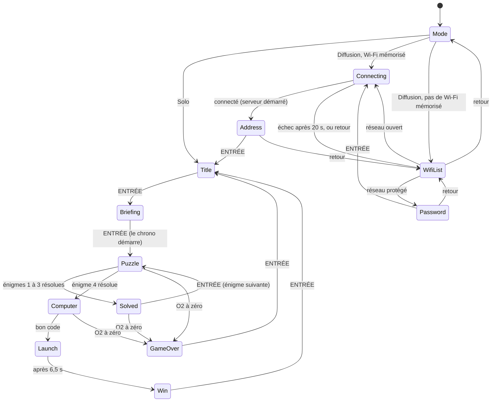
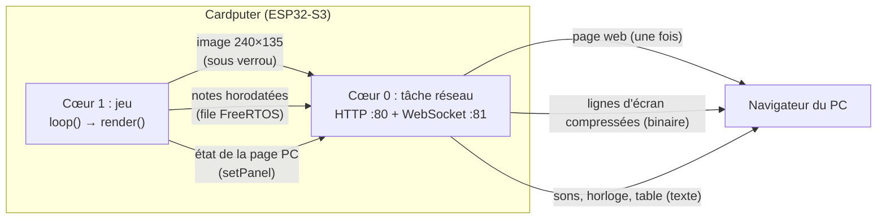

# Explorer 3 : documentation technique

*English version: [TECHNICAL.md](TECHNICAL.md).*

Ce document décrit le fonctionnement interne du jeu pour qui veut le compiler, le comprendre ou le modifier. Il ne donne pas les solutions des énigmes, mais elles sont en clair dans le code source.

Version décrite : **v1.4**.

## Sommaire

1. [Vue d'ensemble](#1-vue-densemble)
2. [Compiler et installer](#2-compiler-et-installer)
3. [Organisation du code](#3-organisation-du-code)
4. [Boucle principale et machine à états](#4-boucle-principale-et-machine-à-états)
5. [Chrono, pénalités et pause](#5-chrono-pénalités-et-pause)
6. [Son](#6-son)
7. [Énigmes](#7-énigmes)
8. [Clavier du Cardputer ADV](#8-clavier-du-cardputer-adv)
9. [Mode diffusion](#9-mode-diffusion)
10. [Clavier codé (jeu asymétrique)](#10-clavier-codé-jeu-asymétrique)
11. [Mémoire et performances](#11-mémoire-et-performances)
12. [Limites connues et sécurité](#12-limites-connues-et-sécurité)
13. [Modifier le jeu](#13-modifier-le-jeu)

## 1. Vue d'ensemble

| | |
|---|---|
| Matériel | M5Stack **Cardputer ADV** : ESP32-S3 (2 cœurs, 240 MHz), 8 Mo de flash, **pas de PSRAM**, écran 240×135, codec audio ES8311 (mono), clavier TCA8418 |
| Framework | Arduino (core ESP32 2.0.x) via PlatformIO |
| Langage | C++17 côté Cardputer, HTML/CSS/JavaScript pour la page web du mode diffusion |
| Fichiers | `src/main.cpp` (le jeu), `src/diffusion.cpp` et `src/diffusion.h` (le mode diffusion) |
| Licence | MIT |

Le jeu dure 5 minutes : 4 énigmes à résoudre dans l'ordre, chacune donne une lettre d'un code de 4 lettres à taper sur l'ordinateur de bord pour faire décoller la fusée.

Deux modes sont proposés au démarrage :

- **Solo** : tout se passe sur le Cardputer.
- **Diffusion** : le Cardputer se connecte au Wi-Fi, sert lui-même une page web, et le navigateur d'un PC affiche une copie en direct de l'écran. Le son sort du PC. À la fin, le PC affiche une table secrète pour le **clavier codé** (section 10).

## 2. Compiler et installer

### Environnement

Configuration de `platformio.ini` :

| Réglage | Valeur |
|---|---|
| Plateforme | `espressif32 @ 6.7.0` (Arduino core 2.0.x) |
| Carte | `esp32-s3-devkitc-1`, flash 8 Mo, partitions `default_8MB.csv` (application jusqu'à 3,3 Mo) |
| USB | `ARDUINO_USB_CDC_ON_BOOT=1`, `ARDUINO_USB_MODE=1` (port série par l'USB natif) |
| Bibliothèques | `m5stack/M5Cardputer ^1.1.1`, `m5stack/M5Unified ^0.2.11`, `m5stack/M5GFX ^0.2.17`, `links2004/WebSockets ^2.6.1` (2.7.3 au moment de la v1.4) |

```
pio run                # compile
pio run -t upload      # compile et flashe par USB
```

Le fichier produit est `.pio/build/cardputer-adv/firmware.bin` (image d'application seule, environ 1,34 Mo).

### Installation avec M5Launcher

M5Launcher garde les applications sur la carte SD et en installe une à la fois. Copier le `.bin` dans le dossier `apps/` de la carte, puis le choisir dans le menu SD de M5Launcher. Les releases GitHub fournissent `Escape-Game-Explorer-3.bin` (français, branche `main`) et `Escape-Game-Explorer-3-EN.bin` (anglais, branche `english`).

### Branches

- `main` : version française.
- `english` : même code, textes et commentaires traduits. Chaque changement est fait sur `main` puis reporté sur `english`.

## 3. Organisation du code

Tout le jeu est dans `src/main.cpp`, dans un espace de noms anonyme. Les sections sont séparées par des commentaires `// ------ nom` :

| Section | Contenu |
|---|---|
| Constantes | Taille d'écran, durée de partie, pénalité, unités Morse, canaux audio, palette de couleurs (RGB565), alphabet Morse, dessins en pixel art (fusée, picross, symboles) |
| Lecteur clavier | `PolledKeyboardReader` (section 8) |
| État global | État courant, chrono, énigme, saisie, pause, record, variables du mode diffusion |
| son | Ordonnanceur de notes, effets sonores, bruit du décollage |
| chrono | `remaining()`, `fmtTime()`, `penalty()` |
| dessin | Primitives (texte, texte ombré, retour à la ligne, décor, HUD, pied de page) |
| Morse, picross | Logique des énigmes |
| écrans | Un `drawXxx()` par écran |
| clavier codé | Génération du clavier, saisie, message vers le PC (section 10) |
| logique | Transitions (`enter`, `startPuzzle`, `solvePuzzle`…), clavier (`handleKey`), mise à jour (`update`), pause |
| `setup()` / `loop()` | Démarrage et boucle principale |

`src/diffusion.cpp` contient tout ce qui touche au réseau, derrière l'interface `mirror::` déclarée dans `src/diffusion.h`. `main.cpp` n'inclut ni le Wi-Fi ni les serveurs.

### Dessin

Tout l'écran est dessiné dans un sprite `M5Canvas` de 240×135 en 16 bits (64 800 octets), puis envoyé d'un coup à l'écran avec `pushSprite()`. Il n'y a donc pas de scintillement, et le mode diffusion peut lire cette même image. La police est `efontJA_12`, choisie parce qu'elle contient les lettres accentuées françaises (É, È, À…), contrairement à `efontCN_12`.

### Données gardées en mémoire (NVS)

Espace `Preferences` nommé `explorer3` :

| Clé | Type | Contenu |
|---|---|---|
| `best_o2` | uint | Record : plus grande réserve d'O2 restante à la victoire (ms) |
| `ssid`, `pass` | chaîne | Dernier Wi-Fi utilisé en mode diffusion, enregistré seulement après une connexion réussie |

## 4. Boucle principale et machine à états

### `loop()`

À chaque tour, environ toutes les 10 à 20 ms :

1. lecture du clavier (`updateKeyList` puis `updateKeysState`) ;
2. lancement des notes arrivées à échéance (`runNotes`) ;
3. touche nouvellement appuyée : `Fn` seul part au compteur de pause, sinon `handleKey()` (sauf en pause) ;
4. `update(now)` (sauf en pause) : chrono, alarme O2, enchaînements temporisés, suivi du Wi-Fi ;
5. en mode diffusion : `updatePanel(now)`, qui envoie l'état de la page du PC ;
6. `render(now)` entre `mirror::lockScreen()` et `mirror::unlockScreen()` ;
7. `delay(10)`.

### États (`enum class St`)



| État | Écran | Remarques |
|---|---|---|
| `Mode` | Choix Solo / Diffusion | Premier écran après le démarrage |
| `WifiList`, `Password`, `Connecting`, `Address` | Configuration du mode diffusion | Section 9 |
| `Title` | Titre (Mars, fusée couchée) | |
| `Briefing` | Journal de bord | ENTRÉE démarre le chrono |
| `Puzzle` | Énigme `puzzle` (0 à 3) | |
| `Solved` | Partie du vaisseau réparée, lettre obtenue | |
| `Computer` | Ordinateur de bord, saisie du code | 5 lignes de texte apparaissent toutes les 600 ms, puis la saisie |
| `Launch` | Animation du décollage (6,5 s) | Chrono arrêté, record enregistré |
| `Win` / `GameOver` | Écrans de fin | ENTRÉE revient au titre, le mode choisi est gardé |

« retour » = touche `` ` `` (accent grave).

`enter(St)` change d'état et note l'heure dans `stateStart`, qui sert aux animations et aux enchaînements temporisés.

## 5. Chrono, pénalités et pause

- La partie dure `GAME_MS` = 5 min. Le chrono repose sur une échéance absolue `deadline` (en `millis()`), et `remaining()` calcule le temps restant.
- **Pénalité** (`penalty()`) : `deadline` recule de `PENALTY_MS` = 10 s. Le bord de l'écran clignote en rouge pendant 0,4 s, « −10 s » s'affiche 1,5 s et le compteur `errCount` augmente (il sert à la page du PC).
- **HUD** : jauge d'O2 verte au-dessus de 50 %, orange au-dessus de 20 %, rouge en dessous. Le temps clignote sous 1 minute. Les cases des lettres du code se remplissent au fil des énigmes.
- **Alarme O2** : 3 bips à 2 kHz, répétés toutes les `1500 + 8500 × restant / GAME_MS` ms, donc de toutes les 10 s au début à toutes les 1,5 s à la fin. Elle se tait pendant les deux énigmes de Morse.
- **Pause du maître du jeu** : `Fn` appuyé seul 3 fois, avec moins de `FN_GAP_MS` = 800 ms entre deux appuis, pendant `Puzzle`, `Solved` ou `Computer`. Le temps restant est gelé dans `pausedRemaining`, le son est coupé et l'énigme masquée. À la reprise, `deadline` et `stateStart` sont décalés de la durée de la pause.
- **Record** : à la victoire, si l'O2 restant dépasse `best_o2`, il est enregistré et l'écran affiche « NOUVEAU RECORD ! ».

## 6. Son

### Canaux

Le haut-parleur de M5Unified mélange plusieurs canaux virtuels :

| Canal | Usage |
|---|---|
| `CH_O2` (0) | Alarme d'oxygène |
| `CH_SFX` (1) | Clics, erreur, succès, défaite, terminal |
| `CH_MORSE` (2) | Signal Morse sonore |
| `CH_RUMBLE` (3) | Grondement du décollage (bruit) |
| `CH_WHISTLE` (4) | Sifflement montant du décollage |

### Ordonnanceur de notes

`schedule(at, freq, dur, ch)` range une note dans un tableau fixe de 64 places (`notes[]`). `runNotes(now)`, appelé deux fois par tour de boucle, joue les notes dont l'heure est passée. Un effet sonore ou un signal Morse est donc une suite de notes horodatées, sans `delay()`. `cancelChannel(ch)` annule les notes en attente d'un canal et coupe ce canal, `stopAllSound()` fait de même pour tous.

C'est le **seul endroit** où le son sort, ce qui permet au mode diffusion de l'envoyer au PC au lieu du haut-parleur (section 9.5) :

- `runNotes` appelle `Speaker.tone()` en solo, et `mirror::sendTone()` en diffusion ;
- `cancelChannel` et `stopAllSound` appellent `Speaker.stop()` en solo, et `mirror::sendStop()` en diffusion ;
- `channelPlaying(ch)` remplace `Speaker.isPlaying(ch)`. En diffusion, il se base sur `chanUntil[ch]`, l'heure de fin de la note en cours, puisque le haut-parleur ne joue rien.

### Décollage

`buildNoise()` calcule au démarrage 1 s de bruit brun à 8 kHz (`noiseBuf`, 16 Ko), avec quelques craquements et un fondu enchaîné pour boucler sans clic. Pendant `Launch`, le volume du canal `CH_RUMBLE` monte de 0 à 255 en 1,5 s, reste au maximum jusqu'à 5 s, puis redescend à 0 à 6,5 s. Le sifflement (40 notes de 120 à 978 Hz) suit la même enveloppe à 70/255.

## 7. Énigmes

Les mécanismes sont décrits ici, pas les réponses.

| # | Mécanisme | Code |
|---|---|---|
| 1 | Un voyant clignote une lettre en Morse (unité `LAMP_UNIT_MS` = 400 ms) ; on tape la lettre | `startMorseLamp()`, `lampOn()` |
| 2 | QCM à 4 réponses (A à D) | `drawPuzzleQuiz()` |
| 3 | Picross 5×5 ; les indices des lignes et colonnes sont calculés à partir du motif `PICROSS[]` | `buildClues()`, `lineClues()`, `picrossSolved()` |
| 4 | Signal Morse sonore, 700 Hz, unité `SOUND_UNIT_MS` = 200 ms ; on tape la lettre | `startMorseSound()` |

- `TAB` affiche l'alphabet Morse (`drawMorseHelp()`), `ESPACE` rejoue le signal.
- Une mauvaise lettre déclenche `penalty()`. Une bonne lettre appelle `solvePuzzle()`.
- Le picross est validé quand la grille est **identique** au motif (`picrossSolved()`). Les indices d'une ligne ou d'une colonne passent en vert dès qu'elle les respecte (`rowOk()`, `colOk()`).

## 8. Clavier du Cardputer ADV

Le clavier de l'ADV est un contrôleur TCA8418 relié en I²C, qui signale ses événements par une interruption sur GPIO11. Le lecteur de la bibliothèque M5Cardputer 1.1.1 ne lit le contrôleur que lorsque cette interruption est arrivée. Si une touche arrive au mauvais moment, l'interruption est perdue, la ligne reste basse et le clavier ne répond plus du tout, alors que le jeu continue de tourner.

`PolledKeyboardReader` remplace ce lecteur : à chaque tour de boucle, il vide la file d'événements du TCA8418 (`getEvent()` jusqu'à 0), sans dépendre de l'interruption. Il produit la même liste de touches que la bibliothèque. Il est installé dans `setup()` avec `M5Cardputer.begin(cfg, false)` puis `Keyboard.begin(std::unique_ptr<KeyboardReader>(...))`, uniquement si la carte détectée est un Cardputer ADV.

## 9. Mode diffusion

### 9.1 Principe



Le PC n'a rien à installer : le Cardputer sert lui-même la page (`http://<adresse>/`) et pousse ensuite tout par WebSocket. Le jeu tourne seul sur le cœur 1, la tâche réseau sur le cœur 0. Le jeu ne bloque donc jamais sur le Wi-Fi.

### 9.2 Interface `mirror::` (`diffusion.h`)

| Fonction | Rôle |
|---|---|
| `startScan()`, `scanDone(out)` | Recherche Wi-Fi asynchrone ; `scanDone` renvoie `true` une fois finie, avec une liste sans doublons triée par puissance |
| `connect(ssid, pass)`, `connected()` | Connexion en mode station, nom d'hôte `explorer3` |
| `address()` | `"http://" + IP locale` |
| `startServer(screen, w, h)` | Démarre la page web, le WebSocket et la tâche réseau, en recevant l'adresse du tampon de l'écran. Un second appel ne fait que couper la mise en veille du Wi-Fi. |
| `clientCount()` | Nombre de navigateurs connectés (affiche « PC connecté ») |
| `lockScreen()`, `unlockScreen()` | Verrou (mutex FreeRTOS) autour du dessin ; ne fait rien tant que le serveur n'est pas démarré |
| `sendTone()`, `sendStop()`, `sendRumble()` | Sons à jouer sur le PC (section 9.5) |
| `setPanel(text)` | État de la page réservée au PC (section 10) |

### 9.3 Configuration du Wi-Fi

Ces écrans sont des états du jeu (`WifiList`, `Password`, `Connecting`, `Address`) et sont dessinés dans le même sprite que le reste :

- la recherche et la connexion sont **non bloquantes**, et `update()` surveille `scanDone()` et `connected()` ;
- pas de connexion au bout de `WIFI_TIMEOUT_MS` = 20 s : retour à la liste avec un message d'erreur ;
- le mot de passe s'affiche en clair pendant la saisie ;
- le Wi-Fi est enregistré en NVS **après** une connexion réussie ;
- `WiFi.setSleep(false)` coupe la mise en veille du Wi-Fi, qui provoquerait sinon des saccades de 100 ms et plus.

### 9.4 Flux d'image

**Choix des lignes.** Toutes les `FRAME_MS` = 40 ms (25 images/s au plus), et seulement si un navigateur est connecté, la tâche réseau prend le verrou de l'écran et calcule pour chaque ligne une empreinte 32 bits (variante de FNV-1a par mots de 32 bits, forcée impaire pour ne jamais valoir 0). Seules les lignes dont l'empreinte a changé sont envoyées. Une empreinte à 0 force le renvoi : c'est ce qui se passe à chaque nouvelle connexion d'un navigateur.

**Codage d'une ligne**, suivant le plus court des deux :

```
[y : 1 octet][0][240 pixels × 2 octets]                  brut
[y : 1 octet][1][n : 1 octet][couleur : 2 octets]...      répétitions, n = 1..255, jusqu'à 240 pixels
```

Les couleurs sont en RGB565, poids fort d'abord, dans l'ordre de la mémoire du sprite. Un message binaire contient une suite de lignes et fait au plus `FRAME_BUF` = 12 Ko. Si une image ne tient pas, la suite part au tour suivant : la reprise se fait à la ligne `nextRow`, pour que le bas de l'écran ne soit pas toujours servi en dernier. Un écran complet du jeu pèse en général 5 à 10 Ko au lieu de 65 Ko.

**Affichage.** La page décode les lignes dans un `ImageData` 240×135 et le dessine dans un `<canvas>` au rythme de `requestAnimationFrame`. Le canvas est agrandi en CSS (rapport 16:9, `image-rendering: pixelated`) pour garder des pixels nets.

### 9.5 Son sur le PC

Le son est envoyé sous forme de commandes, pas d'audio : quelques octets par note. Chaque message texte commence par l'heure du Cardputer au moment de l'envoi :

| Message | Sens |
|---|---|
| `P,maintenant` | Horloge seule, toutes les 250 ms |
| `T,maintenant,à,fréquence,durée,canal` | Jouer une note à l'heure `à` (ms du Cardputer) |
| `S,maintenant,à,canal` | Couper un canal à l'heure `à` (`255` = tous) |
| `R,maintenant,à` | Lancer le grondement du décollage à l'heure `à` |
| `K,maintenant,...` | État de la page du PC (section 10) |

**Synchronisation.** Pour chaque message, la page calcule `performance.now() − maintenant`. Elle garde la plus petite valeur des 40 derniers messages : c'est la mesure la moins retardée par le réseau. Une note prévue à l'heure `à` est jouée par Web Audio à `à + décalage + LAT`, avec `LAT` = 150 ms de marge. Les écarts de délai du Wi-Fi sont absorbés et le rythme du Morse reste exact. En contrepartie, le son est en retard d'environ 0,15 s.

**Synthèse.** Les notes sont des oscillateurs sinusoïdaux, comme la forme d'onde par défaut de M5Unified, avec des rampes de 3 ms pour éviter les clics. Une nouvelle note coupe la précédente du même canal. Le grondement est un bruit brun calculé par la page, joué en boucle avec la même enveloppe que sur le Cardputer. Le sifflement suit cette enveloppe à 70/255. Le volume général est à 0,3.

Les navigateurs interdisent le son avant une action de l'utilisateur. Le contexte audio est donc créé au premier clic sur la page (« Cliquer pour activer le son »). Avant ce clic, les messages de son sont ignorés, mais l'horloge est quand même suivie.

### 9.6 Tâche réseau

`netTask` est épinglée sur le cœur 0, avec une priorité de 1 et une pile de 6 Ko. Elle boucle sur :

1. `http.handleClient()` et `ws.loop()` ;
2. envoi des sons en attente (file FreeRTOS de 64 éléments, remplie sans attente par le jeu) ;
3. envoi de l'état de la page du PC s'il a changé ;
4. horloge toutes les 250 ms ;
5. image toutes les 40 ms ;
6. `vTaskDelay(1)`.

Côté page, une connexion perdue est retentée toutes les secondes. Un nouveau navigateur reçoit l'écran complet et l'état courant de sa page. Plusieurs navigateurs peuvent être ouverts en même temps.

## 10. Clavier codé (jeu asymétrique)

Il n'existe qu'en mode diffusion. Il remplace la saisie du code en lettres sur l'ordinateur de bord par un jeu à deux équipes : le joueur du Cardputer voit des symboles, l'équipe du PC voit la table de correspondance.

### Génération (`buildKeypad()`, à l'entrée dans `Computer`)

- 9 symboles tirés au hasard parmi 12 (`SYMBOLS[]`) et répartis sur les touches `1` à `9` (`keySym[]`) ;
- 9 lettres : les 3 lettres distinctes du code et 6 autres lettres tirées au hasard, réparties au hasard sur ces touches (`keyLetter[]`) ;
- les 12 symboles, inspirés des codes Alt de la page de code 437, sont dessinés en pixel art 12×12 (agrandis ×2 sur le clavier) : ☺ ♥ ♦ ♣ ♠ ♂ ♀ ♪ ☼ ⌂ ▲ ‼. ☻ et ♫ ont été écartés, trop proches de ☺ et ♪.

### Saisie

Le clavier s'affiche 600 ms après la dernière ligne du terminal (`keypadShown()`). `typedCode` garde les touches tapées (`'1'` à `'9'`). DEL efface la dernière. ENTRÉE, quand les 4 touches sont saisies, compare `keypadCode()` (les lettres de ces touches) au code : s'il est bon, la fusée décolle ; sinon, la saisie est vidée et `penalty()` est appelée.

### Page du PC (`updatePanel()` puis `mirror::setPanel()`)

| Texte | Effet sur la page |
|---|---|
| `0` | Copie de l'écran du Cardputer |
| `1,restant_ms,saisis,erreurs,table` | Table à la place de la copie |

- La table est une suite de paires `lettre` + `numéro de symbole en hexadécimal` (`0` à `b`), triée par lettre.
- La page affiche les 9 cases, le chrono O2 et 4 cases qui se remplissent selon `saisis` (sans dire quels symboles ont été tapés). Elle clignote en rouge quand `erreurs` change.
- Le chrono est recalculé localement toutes les 100 ms à partir de `restant_ms` et de l'horloge, pour défiler sans à-coups.
- Le jeu renvoie l'état à chaque changement, et toutes les 500 ms tant que la table est affichée. Pendant la pause et dès la sortie de `Computer`, il envoie `0`.
- Sur le PC, les symboles sont des caractères Unicode suivis de U+FE0E (présentation texte) avec la police « Segoe UI Symbol », pour éviter les émojis en couleur.

## 11. Mémoire et performances

Valeurs mesurées sur la v1.4 :

| Élément | Taille |
|---|---|
| Programme | ~1,34 Mo sur 3,3 Mo (40 %) |
| RAM statique | ~69 Ko sur 320 Ko (21 %), dont le bruit du décollage (16 Ko) |
| Sprite de l'écran (tas) | 64 800 octets |
| Mode diffusion (tas) | Tampon d'envoi 12 Ko, pile de la tâche réseau 6 Ko, file des sons ~1 Ko, plus la pile Wi-Fi et lwIP |
| Débit d'image | 5 à 10 Ko par écran complet, beaucoup moins quand peu de choses bougent ; 25 images/s au plus |
| Délai | Image : un tour de tâche réseau plus le Wi-Fi, en général moins de 100 ms. Son : environ 150 ms, volontaire. |

Sans PSRAM, il faut éviter les grosses allocations : pas de second sprite plein écran ni de tampon d'image complet. C'est pour cela que l'image est envoyée ligne par ligne, avec des empreintes au lieu d'une copie de l'image précédente.

## 12. Limites connues et sécurité

- **Wi-Fi 2,4 GHz seulement** (limite de l'ESP32-S3). Les réseaux « invités » et l'isolation des clients bloquent la page.
- **Pas de chiffrement ni d'authentification** : la page est en HTTP simple et n'importe quel appareil du réseau local peut l'ouvrir. C'est acceptable pour un jeu à la maison, à éviter sur un réseau public.
- **Le mot de passe Wi-Fi est enregistré en clair** dans la NVS du Cardputer.
- L'adresse IP n'est affichée qu'à la connexion. Pour la revoir, il faut redémarrer et choisir de nouveau Diffusion.
- Le tampon d'envoi est alloué au démarrage du serveur sans vérification d'échec. Avec la mémoire actuelle ce n'est pas un problème, mais à surveiller si le jeu grossit.
- En diffusion, le Cardputer est muet : si le PC n'a pas cliqué sur « activer le son », la partie se joue sans son.

## 13. Modifier le jeu

- **Changer la durée ou la pénalité** : `GAME_MS`, `PENALTY_MS`.
- **Ajouter un écran** : ajouter une valeur à `St`, une fonction `drawXxx()`, son `case` dans `render()` et, si besoin, dans `handleKey()` et `update()`.
- **Ajouter un symbole au clavier codé** : ajouter un dessin 12×12 à `SYMBOLS[]` et augmenter `SYM_COUNT`. Ajouter le caractère au **même rang** dans le tableau `SYM` de la page (dans `diffusion.cpp`). Au-delà de 16 symboles, le numéro sur un seul chiffre hexadécimal ne suffit plus et il faut changer le format de la table.
- **Modifier la page du PC** : elle est entièrement dans la chaîne `PAGE` de `diffusion.cpp` (HTML, CSS et JavaScript d'un seul bloc).
- **Traduire** : modifier les textes sur `main`, puis reporter le changement sur la branche `english` en traduisant les textes, les commentaires et la page.
- **Après un changement d'interface**, vérifier qu'aucun texte ne sort de l'écran de 240×135, et utiliser `fit()` pour les textes de longueur variable comme les noms de Wi-Fi.
