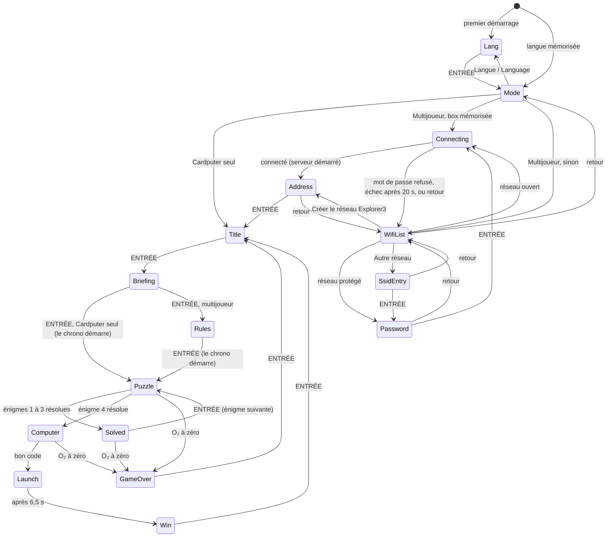
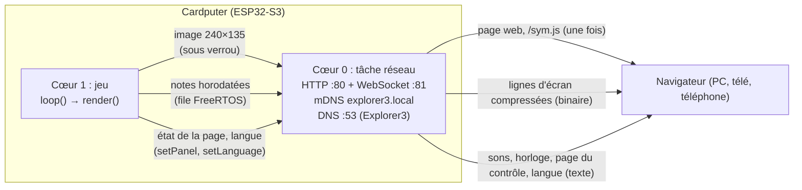

# Explorer 3 : documentation technique

*English version: [TECHNICAL.md](TECHNICAL.md).*

Ce document décrit le fonctionnement interne du jeu pour qui veut le compiler, le comprendre ou le modifier. Il ne donne pas les solutions des énigmes, mais elles sont en clair dans le code source.

Version décrite : **v2.0** : le mode « Avec écran » devient **Multijoueur**, un jeu à deux équipes (code MARS, page du centre de contrôle à chaque énigme, page Règles). Versions précédentes : jeu en français et en anglais, réseau Explorer3, QR codes, compatibilité Firefox 68 et console Ouya, simulateur PC (v1.5) ; écran du téléphone qui reste allumé dans Firefox et Brave (v1.6) ; portail captif sur le réseau Explorer3, pour que la page s'ouvre sur le téléphone même avec les données mobiles (v1.7) ; table du clavier codé adaptée au portrait, pour la fenêtre du portail captif de l'iPhone (v1.8).

## Sommaire

1. [Vue d'ensemble](#1-vue-densemble)
2. [Compiler et installer](#2-compiler-et-installer)
3. [Organisation du code](#3-organisation-du-code)
4. [Boucle principale et machine à états](#4-boucle-principale-et-machine-à-états)
5. [Chrono, pénalités et pause](#5-chrono-pénalités-et-pause)
6. [Son](#6-son)
7. [Énigmes](#7-énigmes)
8. [Clavier du Cardputer ADV](#8-clavier-du-cardputer-adv)
9. [Mode multijoueur](#9-mode-multijoueur)
10. [Page du centre de contrôle (jeu asymétrique)](#10-page-du-centre-de-contrôle-jeu-asymétrique)
11. [Mémoire et performances](#11-mémoire-et-performances)
12. [Limites connues et sécurité](#12-limites-connues-et-sécurité)
13. [Modifier le jeu](#13-modifier-le-jeu)
14. [Simulateur PC](#14-simulateur-pc)

## 1. Vue d'ensemble

| | |
|---|---|
| Matériel | M5Stack **Cardputer ADV** : ESP32-S3 (2 cœurs, 240 MHz), 8 Mo de flash, **pas de PSRAM**, écran 240×135, codec audio ES8311 (mono), clavier TCA8418 |
| Framework | Arduino (core ESP32 2.0.x) via PlatformIO |
| Langage | C++17 côté Cardputer, HTML/CSS/JavaScript pour la page web du mode multijoueur |
| Fichiers | `src/main.cpp` (le jeu), `src/textes.h` (textes français et anglais), `src/diffusion.cpp` et `src/diffusion.h` (le mode multijoueur), `sim/` (simulateur PC) |
| Licence | MIT |

Le jeu dure 5 minutes : 4 énigmes à résoudre dans l'ordre, chacune donne une lettre d'un code de 4 lettres à taper sur l'ordinateur de bord pour faire décoller la fusée.

Le jeu est en **français ou en anglais**, au choix au premier démarrage (section 3). Deux modes sont proposés ensuite :

- **Cardputer seul** : tout se passe sur le Cardputer. Code **NASA**.
- **Multijoueur** : un jeu à deux équipes, code **MARS**. L'**équipage** joue sur le Cardputer, le **centre de contrôle** sur la page web d'un PC, d'une télé ou d'un téléphone. Le Cardputer se connecte au Wi-Fi de la box (ou crée le sien, Explorer3) et sert lui-même cette page. Le son sort de la page. Pendant les énigmes et sur l'ordinateur de bord, la page montre au centre de contrôle la partie des indices que l'équipage n'a pas (section 10) ; le reste du temps, elle recopie l'écran du Cardputer.

## 2. Compiler et installer

### Environnement

Configuration de `platformio.ini` (environnement `cardputer-adv`, celui par défaut) :

| Réglage | Valeur |
|---|---|
| Plateforme | `espressif32 @ 6.7.0` (Arduino core 2.0.x) |
| Carte | `esp32-s3-devkitc-1`, flash 8 Mo, partitions `default_8MB.csv` (application jusqu'à 3,3 Mo) |
| USB | `ARDUINO_USB_CDC_ON_BOOT=1`, `ARDUINO_USB_MODE=1` (port série par l'USB natif) |
| Bibliothèques | `m5stack/M5Cardputer ^1.1.1`, `m5stack/M5Unified ^0.2.11`, `m5stack/M5GFX ^0.2.17`, `links2004/WebSockets ^2.6.1` (versions utilisées pour la v2.0 : 1.1.1, 0.2.25, 0.2.32 et 2.7.3) |

```
pio run                # compile
pio run -t upload      # compile et flashe par USB
pio run -e simulateur  # simulateur PC (section 14)
```

Le fichier produit est `.pio/build/cardputer-adv/firmware.bin` (image d'application seule, environ 1,39 Mo), avec les deux langues.

### Installation avec M5Launcher

M5Launcher garde les applications sur la carte SD et en installe une à la fois. Copier le `.bin` dans le dossier `apps/` de la carte, puis le choisir dans le menu SD de M5Launcher. Les releases GitHub fournissent `Escape-Game-Explorer-3.bin`.

### Release automatique

`.github/workflows/release.yml` : à chaque tag `v…` poussé sur GitHub (par exemple `v1.5`), GitHub Actions compile l'environnement `cardputer-adv`, renomme le firmware en `Escape-Game-Explorer-3.bin` et le joint à la release du tag. Si la release n'existe pas encore, elle est créée avec des notes générées à partir des commits. Les bibliothèques sont gardées en cache d'une compilation à l'autre.

```
git tag v1.5
git push origin v1.5
```

### Branches

Une seule branche, `main`, avec les deux langues. L'ancienne branche `english` n'a plus de raison d'être.

## 3. Organisation du code

Tout le jeu est dans `src/main.cpp`, dans un espace de noms anonyme. Les sections sont séparées par des commentaires `// ------ nom` :

| Section | Contenu |
|---|---|
| Constantes | Taille d'écran, durée de partie, pénalité, unités Morse, canaux audio, palette de couleurs (RGB565), alphabet Morse, dessins en pixel art (fusée, picross, symboles) |
| Lecteur clavier | `PolledKeyboardReader` (section 8) |
| État global | État courant, langue, chrono, énigme, saisie, pause, record, variables du mode multijoueur |
| son | Ordonnanceur de notes, effets sonores, bruit du décollage |
| chrono | `remaining()`, `fmtTime()`, `penalty()` |
| dessin | Primitives (texte, texte ombré, retour à la ligne, décor, HUD, pied de page) |
| Morse, picross | Logique des énigmes |
| écrans | Un `drawXxx()` par écran |
| clavier codé | Génération du clavier, saisie, dessins des symboles pour la page web, état de la page du centre de contrôle (section 10) |
| logique | Transitions (`enter`, `startPuzzle`, `solvePuzzle`…), clavier (`handleKey`), mise à jour (`update`), pause |
| `setup()` / `loop()` | Démarrage et boucle principale |

`src/diffusion.cpp` contient tout ce qui touche au réseau, derrière l'interface `mirror::` déclarée dans `src/diffusion.h`. `main.cpp` n'inclut ni le Wi-Fi ni les serveurs.

### Textes et langues (`src/textes.h`)

Chaque texte affiché est une paire `{ français, anglais }` de type `Tx`, rangée par écran :

```cpp
constexpr Tx P2_FOOTER = {"Répondez A, B, C ou D", "Answer A, B, C or D"};
...
drawFooter(tr(P2_FOOTER));
```

`tr()` renvoie le texte dans la langue courante (`lang` : 0 français, 1 anglais). Les deux traductions sont côte à côte, ce qui évite d'en oublier une. Les textes de la page web sont dans la page elle-même (section 9.7).

**Touches.** Dans les textes, une indication s'écrit « touche : action » (`"ENTRÉE : ok"`) : `hint()` et `drawFooter()` dessinent ce qui précède le premier `:` en orange et le reste dans la couleur du texte. Les flèches du Cardputer (touches `;` `.` `,` `/`) s'écrivent `K_UP`, `K_DOWN`, `K_LEFT`, `K_RIGHT` (codes 1 à 4) et sont dessinées en triangles orange de 9 px. Dans un pied de page, `|` sépare les groupes, que `drawFooter()` répartit sur la largeur (6 à 24 px d'écart). Le retour s'écrit `ESC`.

**Place à l'écran.** La police `efontJA_12` donne 6 px par caractère latin, accents compris, soit 40 caractères sur 240 px. En pratique, l'ensemble des groupes d'un pied de page doit rester sous 230 px environ (largeur moins les écarts minimum), et les colonnes étroites (picross, clavier codé, écran d'adresse) passent à la ligne avec `wrapped()`. Le simulateur (section 14) permet de vérifier chaque écran.

### Dessin

Tout l'écran est dessiné dans un sprite `M5Canvas` de 240×135 en 16 bits (64 800 octets), puis envoyé d'un coup à l'écran avec `pushSprite()`. Il n'y a donc pas de scintillement, et le mode multijoueur peut lire cette même image. La police est `efontJA_12`, choisie parce qu'elle contient les lettres accentuées françaises (É, È, À…), contrairement à `efontCN_12`.

### Données gardées en mémoire (NVS)

Espace `Preferences` nommé `explorer3` :

| Clé | Type | Contenu |
|---|---|---|
| `lang` | uchar | Langue (0 français, 1 anglais). Absente au premier démarrage : l'écran de langue s'affiche |
| `best_o2` | uint | Record : plus grande réserve d'O₂ restante à la victoire (ms) |
| `ssid`, `pass` | chaîne | Dernier Wi-Fi de box utilisé, enregistré seulement après une connexion réussie |
| `auto` | bool | `true` : « Multijoueur » se reconnecte directement à `ssid`. Mis à `false` quand on crée le réseau Explorer3, pour repasser la fois suivante par la liste des Wi-Fi. Absente = `true` |

## 4. Boucle principale et machine à états

### `loop()`

À chaque tour, environ toutes les 10 à 20 ms :

1. lecture du clavier (`updateKeyList` puis `updateKeysState`) ;
2. lancement des notes arrivées à échéance (`runNotes`) ;
3. touche nouvellement appuyée : `Fn` seul part au compteur de pause, sinon `handleKey()` (sauf en pause) ;
4. `update(now)` (sauf en pause) : chrono, alarme O₂, enchaînements temporisés, recherche et connexion Wi-Fi ;
5. en multijoueur : `updatePanel(now)`, qui envoie l'état de la page du centre de contrôle ;
6. `render(now)` entre `mirror::lockScreen()` et `mirror::unlockScreen()` ;
7. `delay(10)`.

### États (`enum class St`)



| État | Écran | Remarques |
|---|---|---|
| `Lang` | Langue / Language | Au premier démarrage, puis depuis le choix du mode |
| `Mode` | Cardputer seul / Multijoueur / Langue | |
| `WifiList`, `SsidEntry`, `Password`, `Connecting`, `Address` | Configuration du mode multijoueur | Section 9.3 |
| `Title` | Titre (Mars, fusée couchée) | |
| `Briefing` | Journal de bord (texte du mode) | Cardputer seul : ENTRÉE démarre le chrono |
| `Rules` | Règles de l'équipage (multijoueur) | Le centre de contrôle a les siennes ; ENTRÉE démarre le chrono |
| `Puzzle` | Énigme `puzzle` (0 à 3) | |
| `Solved` | Partie du vaisseau réparée, lettre gravée dessus | |
| `Computer` | Ordinateur de bord, saisie du code | 5 lignes de texte apparaissent toutes les 600 ms, puis la saisie |
| `Launch` | Animation du décollage (6,5 s) | Chrono arrêté, record enregistré |
| `Win` / `GameOver` | Écrans de fin | ENTRÉE revient au titre, le mode choisi est gardé |

« retour » = `ESC` (touche `` ` `` du Cardputer, testée par `` hasChar(ks, '`') ``).

`enter(St)` change d'état et note l'heure dans `stateStart`, qui sert aux animations et aux enchaînements temporisés.

## 5. Chrono, pénalités et pause

- La partie dure `GAME_MS` = 5 min. Le chrono repose sur une échéance absolue `deadline` (en `millis()`), et `remaining()` calcule le temps restant.
- **Pénalité** (`penalty()`) : `deadline` recule de `PENALTY_MS` = 10 s. Le bord de l'écran clignote en rouge pendant 0,4 s, « −10 s » s'affiche 1,5 s et le compteur `errCount` augmente (il sert à la page de l'écran). La lettre fausse s'affiche avec « ACCÈS REFUSÉ » (énigmes 1, 2 et 4), un mauvais code avec « CODE REFUSÉ » pendant 1,5 s (`codeRefusedUntil`).
- **HUD** : jauge d'O₂ verte au-dessus de 50 %, orange au-dessus de 20 %, rouge en dessous. Le temps clignote sous 1 minute. Les cases des lettres du code se remplissent au fil des énigmes.
- **Alarme O₂** : 3 bips à 2 kHz, répétés toutes les `1500 + 8500 × restant / GAME_MS` ms, donc de toutes les 10 s au début à toutes les 1,5 s à la fin. Elle se tait pendant les deux énigmes de Morse.
- **Pause du maître du jeu** : `Fn` appuyé seul 3 fois, avec moins de `FN_GAP_MS` = 800 ms entre deux appuis, pendant `Puzzle`, `Solved` ou `Computer`. Le temps restant est gelé dans `pausedRemaining`, le son est coupé et l'énigme masquée. À la reprise, `deadline` et `stateStart` sont décalés de la durée de la pause.
- **Record** : à la victoire, si l'O₂ restant dépasse `best_o2`, il est enregistré et l'écran affiche « NOUVEAU RECORD ! ».

## 6. Son

### Canaux

Le haut-parleur de M5Unified mélange plusieurs canaux virtuels :

| Canal | Usage |
|---|---|
| `CH_O2` (0) | Alarme d'oxygène |
| `CH_SFX` (1) | Clics, erreur, succès, défaite, terminal |
| `CH_MORSE` (2) | Signal Morse sonore |
| `CH_RUMBLE` (3) | Grondement du décollage (bruit) |
| `CH_WHISTLE` (4) | Sifflement montant du décollage |

### Ordonnanceur de notes

`schedule(at, freq, dur, ch)` range une note dans un tableau fixe de 64 places (`notes[]`). `runNotes(now)`, appelé deux fois par tour de boucle, joue les notes dont l'heure est passée. Un effet sonore ou un signal Morse est donc une suite de notes horodatées, sans `delay()`. `cancelChannel(ch)` annule les notes en attente d'un canal et coupe ce canal, `stopAllSound()` fait de même pour tous.

C'est le **seul endroit** où le son sort, ce qui permet au mode multijoueur de l'envoyer au navigateur au lieu du haut-parleur (section 9.5) :

- `runNotes` appelle `Speaker.tone()` sur le Cardputer seul, et `mirror::sendTone()` en multijoueur ;
- `cancelChannel` et `stopAllSound` appellent `Speaker.stop()` sur le Cardputer seul, et `mirror::sendStop()` en multijoueur ;
- `channelPlaying(ch)` remplace `Speaker.isPlaying(ch)`. En multijoueur, il se base sur `chanUntil[ch]`, l'heure de fin de la note en cours, puisque le haut-parleur ne joue rien.

### Décollage

`buildNoise()` calcule au démarrage 1 s de bruit brun à 8 kHz (`noiseBuf`, 16 Ko), avec quelques craquements et un fondu enchaîné pour boucler sans clic. Pendant `Launch`, le volume du canal `CH_RUMBLE` monte de 0 à 255 en 1,5 s, reste au maximum jusqu'à 5 s, puis redescend à 0 à 6,5 s. Le sifflement (40 notes de 120 à 978 Hz) suit la même enveloppe à 70/255.

## 7. Énigmes

Les mécanismes sont décrits ici, pas les réponses. L'ordre des énigmes dépend du mode (`ORDER_SOLO`, `ORDER_MULTI`, `puzzleKind()`). La lettre à trouver est celle du code à la place de l'énigme (`answer()` = `code()[puzzle]`, avec `CODE_SOLO` ou `CODE_MULTI`). Les lieux restent dans le même ordre dans les deux modes : coffre du fer à souder, réservoirs de carburant, soute à pièces, ordinateur de bord.

| Type (`Pz`) | Mécanisme | Seul | Multijoueur | Code |
|---|---|---|---|---|
| `Lamp` | Un voyant clignote une lettre en Morse (unité `LAMP_UNIT_MS` = 400 ms) ; on tape la lettre | 1 | 1 | `startMorseLamp()`, `lampOn()` |
| `Quiz` | QCM à 4 réponses (A à D) ; en multijoueur, réponses chiffrées en César | 2 | 2 | `drawPuzzleQuiz()`, `caesar()` |
| `Picross` | Picross 5×5 ; les indices des lignes et colonnes sont calculés à partir du motif `PICROSS[]` | 3 | 4 | `buildClues()`, `lineClues()`, `picrossSolved()` |
| `Sound` | Signal Morse sonore, 700 Hz, unité `SOUND_UNIT_MS` = 200 ms ; on tape la lettre | 4 | 3 | `startMorseSound()`, `drawPuzzleSoundMulti()` |

- Cardputer seul : `TAB` affiche l'alphabet Morse (`drawMorseHelp()`), n'importe quelle touche le ferme, `ESPACE` relance le signal (« revoir » pour le voyant, « réécouter » pour le son).
- Multijoueur : pas de `TAB`. `ESPACE` relance le signal, qui sort sur la page du centre de contrôle pour le son. Ce que voit chaque équipe est décrit section 10.
- Une mauvaise lettre déclenche `penalty()`. Une bonne lettre appelle `solvePuzzle()`.
- Le picross est validé quand la grille est **identique** au motif (`picrossSolved()`). Les cases allumées sont orange sur fond sombre ; les indices d'une ligne ou d'une colonne passent en vert dès qu'elle les respecte (`rowOk()`, `colOk()`). En multijoueur, l'équipage voit des « ? » à la place des chiffres, qui passent aussi au vert.

## 8. Clavier du Cardputer ADV

Le clavier de l'ADV est un contrôleur TCA8418 relié en I²C, qui signale ses événements par une interruption sur GPIO11. Le lecteur de la bibliothèque M5Cardputer 1.1.1 ne lit le contrôleur que lorsque cette interruption est arrivée. Si une touche arrive au mauvais moment, l'interruption est perdue, la ligne reste basse et le clavier ne répond plus du tout, alors que le jeu continue de tourner.

`PolledKeyboardReader` remplace ce lecteur : à chaque tour de boucle, il vide la file d'événements du TCA8418 (`getEvent()` jusqu'à 0), sans dépendre de l'interruption. Il produit la même liste de touches que la bibliothèque. Il est installé dans `setup()` avec `M5Cardputer.begin(cfg, false)` puis `Keyboard.begin(std::unique_ptr<KeyboardReader>(...))`, uniquement si la carte détectée est un Cardputer ADV.

## 9. Mode multijoueur

### 9.1 Principe



Le centre de contrôle n'a rien à installer : le Cardputer sert lui-même la page (`http://<adresse>/`) et pousse ensuite tout par WebSocket. Le jeu tourne seul sur le cœur 1, la tâche réseau sur le cœur 0. Le jeu ne bloque donc jamais sur le Wi-Fi.

### 9.2 Interface `mirror::` (`diffusion.h`)

| Fonction | Rôle |
|---|---|
| `startScan()`, `pollScan(out)` | Recherche Wi-Fi en deux passes, non bloquante (section 9.3). `pollScan` renvoie `Running`, `Partial` (première liste), `Done` (liste complète) ou `Failed` |
| `connect(ssid, pass)`, `link()`, `failure()`, `attempt()` | Connexion à une box, nom d'hôte `explorer3`. `link()` : `Connecting`, `Connected` ou `BadPassword` ; `failure()` : cause probable après le délai (`NotFound` ou `NoAnswer`) ; `attempt()` : numéro de l'essai en cours |
| `startAccessPoint()`, `accessPoint()`, `apClients()`, `wifiQrText()` | Réseau Explorer3 créé par le Cardputer (section 9.3) |
| `ipAddress()` | Adresse IP sur la box ou sur Explorer3 (`192.168.4.1`) |
| `startServer(screen, w, h)` | Démarre la page web, le WebSocket, la tâche réseau et annonce `explorer3.local`, en recevant l'adresse du tampon de l'écran. Renvoie `false` sans rien démarrer si la mémoire manque. Un second appel (changement de réseau) annonce de nouveau le nom mDNS et coupe la mise en veille du Wi-Fi |
| `clientCount()` | Nombre de navigateurs connectés (affiche « Navigateur connecté ») |
| `lockScreen()`, `unlockScreen()` | Verrou (mutex FreeRTOS) autour du dessin ; ne fait rien tant que le serveur n'est pas démarré |
| `sendTone()`, `sendStop()`, `sendRumble()` | Sons à jouer par le navigateur (section 9.5) |
| `setPanel(text)` | État de la page du centre de contrôle (section 10) |
| `setLanguage(lang)` | Langue de la page (section 9.7) |
| `setSymbols(js)` | Dessins des symboles servis en `/sym.js` (section 10) |
| `AP_SSID`, `AP_PASS`, `HOST_NAME` | `Explorer3`, `Explorer3`, `explorer3.local` |

### 9.3 Configuration du Wi-Fi

Ces écrans sont des états du jeu (`WifiList`, `SsidEntry`, `Password`, `Connecting`, `Address`) et sont dessinés dans le même sprite que le reste. Tout est **non bloquant** : `update()` interroge `pollScan()` et `link()` à chaque tour.

**Liste des Wi-Fi.** En tête, « Créer le réseau Explorer3 » ; puis les réseaux trouvés, triés par signal, avec un cadenas pour les réseaux protégés et 4 barres de signal (−60, −70, −78 dBm) ; en dernier, « Autre réseau (nom à taper) » pour un réseau masqué. `R` relance la recherche. Un message d'erreur s'efface dès qu'on se déplace dans la liste.

**Recherche en deux passes.** Les anciennes versions affichaient souvent « Aucun réseau trouvé » à tort : un refus du pilote ou un dépassement de délai était pris pour une liste vide. La recherche est maintenant une petite machine à états dans `diffusion.cpp` :

1. `startScan()` repasse en mode station (en arrêtant le réseau Explorer3 s'il tournait), interrompt une tentative de connexion (`WiFi.disconnect()`) et vide la liste.
2. **Passe active** (`scanNetworks(async, …, 400 ms par canal)`) : les box répondent à une demande. À la fin, `pollScan` renvoie `Partial` et la liste s'affiche.
3. **Passe passive** (300 ms par canal) : écoute des balises, pour les box qui répondent mal aux demandes. Ses réseaux sont ajoutés à la liste (sans doublons, avec le meilleur signal), qui se met à jour sans perdre la sélection. Trois points animés après le titre indiquent qu'elle est en cours.
4. Si le pilote refuse de démarrer une passe (il le fait pendant une tentative de connexion) ou si elle échoue, elle est retentée 700 ms plus tard, après avoir arrêté la recherche matérielle (`esp_wifi_scan_stop()`) et la connexion en cours, jusqu'à 5 fois. Si la première passe n'aboutit jamais : « Recherche impossible : R pour réessayer » (les entrées Explorer3 et Autre réseau restent utilisables). Si c'est la seconde, la première liste est gardée.

Les durées par canal restent sous la limite cachée de la bibliothèque, qui déclare une recherche échouée au bout de 20 fois la durée par canal.

**Connexion.** `connect()` laisse le pilote réessayer de lui-même (`setAutoReconnect(true)`). Un gestionnaire d'événement `ARDUINO_EVENT_WIFI_STA_DISCONNECTED` note chaque cause de déconnexion :

| Cause du pilote | Effet |
|---|---|
| `AUTH_FAIL`, `4WAY_HANDSHAKE_TIMEOUT`, `HANDSHAKE_TIMEOUT` deux fois | « Mot de passe refusé », retour à la liste |
| Dernière cause `NO_AP_FOUND` au bout de `WIFI_TIMEOUT_MS` = 20 s | « Réseau introuvable » |
| Autre cause au bout de 20 s | « Le réseau ne répond pas » |

Il faut deux refus pour conclure au mauvais mot de passe, car un signal faible peut aussi faire échouer l'échange de clés. L'écran de connexion affiche « Essai n° 2 », « Essai n° 3 »… à chaque nouvel essai du pilote.

- Le mot de passe s'affiche en clair pendant la saisie ; il est prérempli si on rechoisit le Wi-Fi mémorisé.
- Le Wi-Fi est enregistré en NVS **après** une connexion réussie.
- `WiFi.setSleep(false)` coupe la mise en veille du Wi-Fi, qui provoquerait sinon des saccades de 100 ms et plus.

**Réseau Explorer3.** Pour jouer sans box (ou sur un réseau « invités » qui isole les appareils), le Cardputer devient point d'accès : `WiFi.softAP("Explorer3", "Explorer3")`, WPA2, adresse `192.168.4.1`. Le mot de passe fait 8 caractères, le minimum du WPA2. Ce choix n'est pas mémorisé (`auto` = `false`) : la fois suivante, « Multijoueur » repasse par la liste.

**Écran d'adresse et QR codes.** Un QR code de 99×99 px à gauche (`canvas.qrcode()` de M5GFX, correction d'erreur minimale), les textes à droite :

| Situation | QR code | Textes |
|---|---|---|
| Box | `http://<IP>` (version 2 : 25 modules de 3 px, 4 modules de marge blanche) | Adresse IP, `explorer3.local`, état du navigateur |
| Explorer3, d'abord | `WIFI:T:WPA;S:Explorer3;P:Explorer3;;` (version 3 : 29 modules, 2 de marge) : un téléphone rejoint le Wi-Fi en le scannant | Nom et mot de passe du réseau, nombre d'appareils connectés |
| Explorer3, ensuite | `http://192.168.4.1` | Comme pour la box |

Avec Explorer3, l'écran passe tout seul au QR code de la page dès qu'un appareil rejoint le réseau (une seule fois, `apJoined`) ; `TAB` bascule de l'un à l'autre à tout moment.

**Portail captif (Explorer3).** Explorer3 n'a pas d'accès à Internet. Un téléphone Android qui a aussi les données mobiles garde alors la 4G comme réseau principal, et son navigateur l'utilise pour toutes les adresses, `192.168.4.1` comprise : la page ne s'ouvre pas. `explorer3.local` échoue aussi, car Android ne résout pas les noms `.local` par les données mobiles, et taper `http://` devant n'y change rien. Aucune page web ne peut choisir le réseau utilisé. Le Cardputer se comporte donc comme le Wi-Fi d'un hôtel, pour que le système ouvre lui-même la page dans sa fenêtre « Se connecter au réseau », qui passe par le Wi-Fi même quand la 4G est allumée :

- **DNS** (`answerDns()`, port 53, seulement en point d'accès) : à une demande d'adresse IPv4 (type A), pour n'importe quel nom, il répond `192.168.4.1`, avec une durée de vie de 10 s pour que rien ne reste en cache après la partie. Aux autres types (AAAA, HTTPS…), il fait une réponse vide. Les paquets mal formés ou de plus de 512 octets sont ignorés. Ce petit répondeur remplace la bibliothèque `DNSServer` du core Arduino, qui ne vérifie pas la longueur des noms reçus.
- **Redirection** (`redirectToPage()`) : une requête HTTP dont l'en-tête `Host` n'est ni `192.168.4.1` ni `explorer3.local` reçoit une redirection `302` vers `http://192.168.4.1/`. C'est le cas des tests de connexion d'Android (`connectivitycheck.gstatic.com/generate_204`…), de l'iPhone (`captive.apple.com`) et de Windows (`msftconnecttest.com`) : le système conclut à un portail et affiche la page. Les tests en HTTPS échouent tout de suite, rien n'écoutant sur le port 443.
- Sur Android, la fenêtre s'ouvre toute seule ou par la notification « Se connecter au réseau », selon le téléphone. Le reste du téléphone garde Internet par la 4G. Sur la box, rien de tout cela n'est actif.

**Nom `explorer3.local`.** `startServer()` (re)lance le répondeur mDNS (`MDNS.begin("explorer3")`, service `_http._tcp`) sur le réseau en place, box ou Explorer3. Les PC, Mac, iPhone et Android récents le résolvent ; pas la Ouya (Android 4.1), d'où l'adresse IP toujours affichée.

### 9.4 Flux d'image

**Choix des lignes.** Toutes les `FRAME_MS` = 40 ms (25 images/s au plus), et seulement si un navigateur est connecté, la tâche réseau prend le verrou de l'écran et calcule pour chaque ligne une empreinte 32 bits (variante de FNV-1a par mots de 32 bits, forcée impaire pour ne jamais valoir 0). Seules les lignes dont l'empreinte a changé sont envoyées. Une empreinte à 0 force le renvoi : c'est ce qui se passe à chaque nouvelle connexion d'un navigateur.

**Codage d'une ligne**, suivant le plus court des deux :

```
[y : 1 octet][0][240 pixels × 2 octets]                  brut
[y : 1 octet][1][n : 1 octet][couleur : 2 octets]...      répétitions, n = 1..255, jusqu'à 240 pixels
```

Les couleurs sont en RGB565, poids fort d'abord, dans l'ordre de la mémoire du sprite. Un message binaire contient une suite de lignes et fait au plus `FRAME_BUF` = 12 Ko. Si une image ne tient pas, la suite part au tour suivant : la reprise se fait à la ligne `nextRow`, pour que le bas de l'écran ne soit pas toujours servi en dernier. Un écran complet du jeu pèse en général 5 à 10 Ko au lieu de 65 Ko.

**Affichage.** La page décode les lignes dans un `ImageData` 240×135 et le dessine dans un `<canvas>` au rythme de `requestAnimationFrame`. Le canvas est agrandi en CSS (rapport 16:9, `image-rendering: pixelated`, `crisp-edges` pour Firefox) pour garder des pixels nets. La taille est donnée par `width: 100vw; height: 56.25vw` bornées par `max-width: 177.78vh; max-height: 100vh`. Le résultat est le même qu'avec `min()`, mais fonctionne aussi dans Firefox 68 (section 9.8).

Tout ce qui s'affiche est dans un bloc `#ecran`, que la **marge télé** réduit avec `transform: scale(1 − 2 × marge / 100)` (section 9.8). Sans marge, aucune transformation n'est appliquée.

### 9.5 Son sur la page

Le son est envoyé sous forme de commandes, pas d'audio : quelques octets par note. Chaque message texte commence par l'heure du Cardputer au moment de l'envoi :

| Message | Sens |
|---|---|
| `P,maintenant` | Horloge seule, toutes les 250 ms |
| `T,maintenant,à,fréquence,durée,canal` | Jouer une note à l'heure `à` (ms du Cardputer) |
| `S,maintenant,à,canal` | Couper un canal à l'heure `à` (`255` = tous) |
| `R,maintenant,à` | Lancer le grondement du décollage à l'heure `à` |
| `K,maintenant,...` | État de la page du centre de contrôle (section 10) |
| `L,maintenant,fr` ou `en` | Langue de la page (section 9.7) |

**Synchronisation.** Pour chaque message, la page calcule `performance.now() − maintenant`. Elle garde la plus petite valeur des 40 derniers messages : c'est la mesure la moins retardée par le réseau. Une note prévue à l'heure `à` est jouée par Web Audio à `à + décalage + LAT`, avec `LAT` = 150 ms de marge. Les écarts de délai du Wi-Fi sont absorbés et le rythme du Morse reste exact. En contrepartie, le son est en retard d'environ 0,15 s.

**Synthèse.** Les notes sont des oscillateurs sinusoïdaux, comme la forme d'onde par défaut de M5Unified, avec des rampes de 3 ms pour éviter les clics. Une nouvelle note coupe la précédente du même canal. Le grondement est un bruit brun calculé par la page, joué en boucle avec la même enveloppe que sur le Cardputer. Le sifflement suit cette enveloppe à 70/255. Le volume général est à 0,3.

Les navigateurs interdisent le son avant une action de l'utilisateur. Le contexte audio est donc créé au premier clic sur la page ou à la première touche du clavier ou de la manette (« Cliquer ou appuyer sur une touche pour activer le son »). Avant cela, les messages de son sont ignorés, mais l'horloge est quand même suivie. Si le navigateur suspend le contexte audio (page cachée, console mise en arrière-plan), il est relancé (`resume()`) au clic, à la touche ou au retour sur la page suivants.

### 9.6 Tâche réseau

`netTask` est épinglée sur le cœur 0, avec une priorité de 1 et une pile de 6 Ko. `startServer()` la crée en premier : elle attend un signal (`ulTaskNotifyTake`) pendant que les serveurs démarrent. Si la tâche ne peut pas être créée, rien n'a encore été démarré. Ensuite elle boucle sur :

1. sur Explorer3 : démarrage ou arrêt du DNS selon le mode Wi-Fi, puis réponse à une question en attente ;
2. `http.handleClient()` et `ws.loop()` ;
3. envoi des sons en attente (file FreeRTOS de 64 éléments, remplie sans attente par le jeu) ;
4. envoi de la langue si elle a changé ;
5. envoi de l'état de la page du centre de contrôle s'il a changé ;
6. horloge toutes les 250 ms ;
7. image toutes les 40 ms ;
8. `vTaskDelay(1)`.

Le serveur HTTP répond à `/` (la page) et `/sym.js` (les dessins des symboles, section 10). Sur Explorer3, toute autre adresse est renvoyée vers la page (portail captif, section 9.3). Côté page, une connexion perdue est retentée toutes les secondes. Un nouveau navigateur reçoit l'écran complet, la langue et l'état courant de sa page. Plusieurs navigateurs peuvent être ouverts en même temps.

**Heartbeat.** Le serveur WebSocket envoie un ping toutes les 5 s (`ws.enableHeartbeat(5000, 3000, 2)`), et les navigateurs y répondent d'eux-mêmes. Un navigateur qui ne répond pas à 2 pings de suite (3 s d'attente chacun) est déconnecté, donc au bout de 11 à 16 s. C'est le cas d'un Wi-Fi coupé ou d'une console éteinte sans fermer la page. Sans heartbeat, il resterait compté dans `clientCount()` jusqu'au délai TCP, et le Cardputer continuerait à lui envoyer des images.

### 9.7 Langue de la page

La page contient ses textes dans les deux langues (objet `TX` du JavaScript). Elle démarre dans la dernière langue reçue (gardée dans le `localStorage`), sinon dans celle du navigateur, puis applique celle du Cardputer dès le message `L` (envoyé à chaque connexion et à chaque changement de langue sur le Cardputer). Les éléments à traduire ont un identifiant `t-…`, remplis par `langue()`.

### 9.8 Navigateurs compatibles, console Ouya

La page vise les navigateurs actuels (Chrome, Edge, Firefox, Safari) **et Firefox 68**, la dernière version de Firefox pour Android 4.1. C'est celle qui permet d'utiliser une **console Ouya** branchée sur une télé. Le navigateur d'origine d'Android 4.1 ne connaît ni les WebSocket ni Web Audio : il ne peut pas servir.

Ce qu'il faut respecter dans la page pour rester compatible avec Firefox 68 :

| À éviter | À utiliser | Raison |
|---|---|---|
| `min()`, `max()`, `clamp()` en CSS | `width`/`height` + `max-width`/`max-height` | Firefox ≥ 75 |
| `inset: 0` | `top: 0; right: 0; bottom: 0; left: 0` | Firefox ≥ 66 (et Chrome ≥ 87) |
| `gap` dans un flexbox | Marges (`#tab > * + *`) | Chrome ≥ 84 (Firefox ≥ 63) |
| `?.`, `??`, `catch {}` sans variable en JavaScript | Tests explicites, `catch (_)` | Firefox ≥ 74, 72 et 58 |

Le JavaScript ES2017 (`let`/`const`, fonctions fléchées, `for…of`, spread, `padStart`) est accepté.

**Commandes au clavier, à la télécommande ou à la manette.** Elles s'ajoutent au clic et au double-clic, qui restent valables :

| Touche | Effet |
|---|---|
| Première touche (n'importe laquelle) | Active le son, comme le clic |
| `Entrée` (bouton `O` de la manette Ouya), `F` | Plein écran ou retour |
| Flèche haut, `+` | Marge télé +1 % |
| Flèche bas, `-` | Marge télé −1 % |

Les touches combinées avec `Ctrl`, `Alt` ou `Méta` sont ignorées, pour ne pas gêner les raccourcis du navigateur.

**Marge télé (overscan).** Beaucoup de télés coupent les bords de l'image. La marge, de 0 à 15 % de chaque côté, réduit l'ensemble de la page. Elle est gardée dans le `localStorage` du navigateur (dans un `try`, car le stockage peut être interdit). On peut aussi l'imposer avec `?marge=5` dans l'adresse. Un message « Marge télé : n % » s'affiche 1,5 s à chaque réglage.

**Écran toujours allumé.** Dès que le son est activé, la page lit une vidéo muette et presque invisible (`#veille`, 2×2 px). Sur Android, un navigateur qui lit une vidéo empêche l'écran de se mettre en veille, mais pas pour n'importe quelle vidéo : Firefox ne le fait pour une vidéo sans son que si elle vient d'un flux (`MediaStream`), et Chrome/Brave demandent une vidéo grande (20 % de l'écran au moins), avec du son, ou venant d'un flux. La vidéo reçoit donc le flux (`captureStream()`) d'un petit canvas de 16×16 px (`#veillec`), redessiné chaque seconde pour que le flux reste vivant. Un navigateur sans `captureStream()` garde l'ancienne source, une vidéo WebM noire de 16×16 px et 2 s en boucle (502 octets intégrés en base64). L'API Wake Lock est aussi demandée quand elle existe, mais elle n'est disponible qu'en HTTPS, donc jamais sur cette page. L'économiseur d'écran de la Ouya n'est pas garanti d'être bloqué : à vérifier sur la console.

**Installer Firefox 68 sur la Ouya.** L'APK officiel est `fennec-68.11.0.multi.android-arm.apk`, sur archive.mozilla.org (`pub/mobile/releases/68.11.0/android-api-16/multi/`). Il s'installe avec `adb install` ou en le téléchargeant en HTTP depuis un PC du réseau, après avoir autorisé les sources inconnues. Voir le README.

## 10. Page du centre de contrôle (jeu asymétrique)

Elle n'existe qu'en multijoueur. L'équipage joue sur le Cardputer, le centre de contrôle sur la page web. Chaque équipe n'a qu'une partie des indices : elles doivent se parler. Avant le chrono, chacune a sa page Règles (`St::Rules` sur le Cardputer, `R` sur la page), qui dit aussi de ne pas montrer son écran à l'autre équipe.

### Pages (`updatePanel()` puis `mirror::setPanel()`)

| Texte | Moment | Centre de contrôle (page) | Équipage (Cardputer) |
|---|---|---|---|
| `0` | Titre, journal de bord, parties réparées, pause, décollage, fins | Copie de l'écran du Cardputer | |
| `R` | Règles, avant le chrono | Ses règles | Ses règles |
| `1,…` | Énigme 1, coffre (M) | Alphabet Morse, rappel point = flash court, trait = flash long | Le voyant, sans alphabet |
| `2,…` | Énigme 2, réservoirs (A) | L'indice du décalage de César | La question en clair et les 4 réponses chiffrées |
| `3,…` | Énigme 3, soute (R) | Le signal sonore, un haut-parleur qui s'allume à chaque bip | L'alphabet Morse en permanence, `ESPACE` relance le signal |
| `4,…` | Énigme 4, ordinateur de bord (S) | Les vrais chiffres et la grille de l'équipage en direct | La grille, avec des « ? » à la place des chiffres |
| `C,…` | Ordinateur de bord, code | Table de décodage du clavier codé | Le clavier codé |

- Pour `1` à `4` et `C`, le texte continue par `restant_ms,erreurs,données`. La page affiche alors « CENTRE DE CONTRÔLE », le titre et le chrono O₂, recalculé localement toutes les 50 ms à partir de `restant_ms` et de l'horloge pour défiler sans à-coups. Elle clignote en rouge quand `erreurs` change.
- Données du picross : `grille,lignes,colonnes`, soit 25 chiffres `0`/`1` ligne par ligne, puis les indices (lignes séparées par `/`, chiffres d'une ligne par `.`, par exemple `3.1/1.1.1`). La page recalcule quelles lignes et colonnes respectent leurs indices, pour les passer en vert.
- Données du clavier codé : `saisis,table`. La table est une suite de paires `lettre` + `numéro de symbole en hexadécimal` (`0` à `b`), triée par lettre. La page affiche les 9 cases et 4 cases qui se remplissent selon `saisis`, sans dire quels symboles ont été tapés.
- Le jeu renvoie l'état à chaque changement, et toutes les 500 ms pendant les énigmes et le clavier codé. Pendant la pause, il envoie `0`.
- La page ne reconstruit son contenu que si la page ou ses données changent, pas à chaque envoi du chrono.
- **Énigme 2.** Les réponses sont écrites en clair dans `textes.h` (`P2_ANSWERS_MULTI`) et chiffrées à l'affichage par `caesar()`, avec `CAESAR_SHIFT` = 4. L'indice du centre de contrôle donne ce décalage par une devinette.
- **Énigme 3.** La page note l'heure de chaque note du canal `CH_MORSE` (messages `T`) et allume le haut-parleur pendant les bips, même si le son n'est pas activé.
- **Portrait.** Les tailles de la page sont en `vh`, proportionnelles à la hauteur de l'écran. En portrait, le contenu deviendrait plus large que l'écran : c'est le cas dans la fenêtre du portail captif de l'iPhone, qui reste toujours en portrait, et aucune page web ne peut la faire pivoter. Un bloc `@media (orientation:portrait)` remplace donc ces tailles par des tailles en `vw`, proportionnelles à la largeur, et l'alphabet Morse passe de 7 à 3 colonnes. En paysage, il ne s'applique pas.

### Clavier codé : génération (`buildKeypad()`, à l'entrée dans `Computer`)

- 9 symboles tirés au hasard parmi 12 (`SYMBOLS[]`) et répartis sur les touches `1` à `9` (`keySym[]`) ;
- 9 lettres : les lettres distinctes du code (les 4 de MARS) et d'autres lettres tirées au hasard, réparties au hasard sur ces touches (`keyLetter[]`) ;
- les 12 symboles, inspirés des codes Alt de la page de code 437, sont dessinés en pixel art 12×12 (agrandis ×2 sur le clavier) : ☺ ♥ ♦ ♣ ♠ ♂ ♀ ♪ ☼ ⌂ ▲ ‼. ☻ et ♫ ont été écartés, trop proches de ☺ et ♪.

### Clavier codé : saisie

Le clavier s'affiche 600 ms après la dernière ligne du terminal (`keypadShown()`). `typedCode` garde les touches tapées (`'1'` à `'9'`). DEL efface la dernière. ENTRÉE, quand les 4 touches sont saisies, compare `keypadCode()` (les lettres de ces touches) au code : s'il est bon, la fusée décolle ; sinon, la saisie est vidée, « CODE REFUSÉ » remplace la consigne pendant 1,5 s et `penalty()` est appelée.

**Symboles sur la page.** Ce sont les **mêmes dessins** que sur le Cardputer, sans copie à tenir à jour : au démarrage, `buildSymbolsJs()` les code en JavaScript (`const SYM=[…]`, 36 chiffres hexadécimaux par symbole, soit 3 par ligne de 12 pixels, bit de poids fort = pixel de gauche) et `mirror::setSymbols()` les sert en `/sym.js`. La page charge ce script, puis `symbole(n)` fait de chaque dessin un SVG `viewBox="0 0 12 12"` avec `shape-rendering="crispEdges"`, en regroupant les pixels voisins d'une ligne en un seul rectangle. Le rendu ne dépend d'aucune police.

## 11. Mémoire et performances

Valeurs mesurées sur la v2.0 :

| Élément | Taille |
|---|---|
| Programme | ~1,41 Mo sur 3,3 Mo (42 %), dont la page web ~19 Ko et le répondeur mDNS ~40 Ko |
| RAM statique | ~72 Ko sur 320 Ko (22 %), dont le bruit du décollage (16 Ko) et le tampon du DNS (512 octets) |
| Sprite de l'écran (tas) | 64 800 octets |
| Mode multijoueur (tas) | Tampon d'envoi 12 Ko, pile de la tâche réseau 6 Ko, file des sons ~1 Ko, plus la pile Wi-Fi, lwIP et mDNS |
| Débit d'image | 5 à 10 Ko par écran complet, beaucoup moins quand peu de choses bougent ; 25 images/s au plus |
| Délai | Image : un tour de tâche réseau plus le Wi-Fi, en général moins de 100 ms. Son : environ 150 ms, volontaire. |

Sans PSRAM, il faut éviter les grosses allocations : pas de second sprite plein écran ni de tampon d'image complet. C'est pour cela que l'image est envoyée ligne par ligne, avec des empreintes au lieu d'une copie de l'image précédente.

## 12. Limites connues et sécurité

- **Wi-Fi 2,4 GHz seulement** (limite de l'ESP32-S3). Les réseaux « invités » et l'isolation des clients bloquent la page : utiliser le réseau Explorer3.
- **Pas de chiffrement ni d'authentification** : la page est en HTTP simple et n'importe quel appareil du réseau local peut l'ouvrir. C'est acceptable pour un jeu à la maison, à éviter sur un réseau public.
- **Le réseau Explorer3 a un mot de passe connu de tous** (il est dans le README et sur l'écran). Il protège seulement des connexions par hasard.
- **Le mot de passe Wi-Fi est enregistré en clair** dans la NVS du Cardputer.
- Si la mémoire manque au démarrage du serveur (tampon d'envoi, verrou, file des sons, tâche réseau), rien n'est démarré et le Cardputer affiche « Mémoire insuffisante ». Avec la mémoire actuelle, cela ne devrait pas arriver.
- En multijoueur, le Cardputer est muet : si personne n'a cliqué ou appuyé sur une touche pour activer le son sur la page, la partie se joue sans son, et le centre de contrôle n'entend pas le signal de l'énigme 3.
- `explorer3.local` ne fonctionne pas sur la Ouya ni sur les vieux Android : l'adresse IP reste affichée.
- Sur la Ouya, le blocage de la mise en veille par la vidéo invisible (section 9.8) n'a pas été vérifié sur la console.
- Les causes d'échec Wi-Fi viennent du pilote : « Mot de passe refusé » peut, rarement, venir d'un signal très faible.
- Sur Explorer3, avec un téléphone Android qui a les données mobiles, la page marche dans la fenêtre « Se connecter au réseau » (portail captif, section 9.3), pas dans un navigateur ouvert à la main : Firefox, Brave ou le QR code de la page passent par la 4G. Dans cette fenêtre, pas de plein écran.
- Le portail captif a été vérifié sur Android et sur iPhone. Sur iPhone, sa fenêtre reste en portrait (section 10). Sous Windows, le système ouvre aussi sa propre fenêtre : pas encore vérifié.

## 13. Modifier le jeu

- **Changer la durée ou la pénalité** : `GAME_MS`, `PENALTY_MS`.
- **Changer un texte** : dans `src/textes.h`, les deux langues côte à côte. Vérifier qu'il tient à l'écran (section 3) avec le simulateur.
- **Ajouter une langue** : passer `Tx` à 3 cases, compléter chaque texte, ajouter la langue à l'écran `Lang` et à l'objet `TX` de la page.
- **Ajouter un écran** : ajouter une valeur à `St`, une fonction `drawXxx()`, son `case` dans `render()` et, si besoin, dans `handleKey()` et `update()`.
- **Ajouter ou modifier un symbole du clavier codé** : changer le dessin 12×12 dans `SYMBOLS[]` (et `SYM_COUNT` pour un ajout). La page reçoit le même dessin tout seul (`/sym.js`). Au-delà de 16 symboles, le numéro sur un seul chiffre hexadécimal ne suffit plus et il faut changer le format de la table.
- **Modifier la page du centre de contrôle** : elle est entièrement dans la chaîne `PAGE` de `diffusion.cpp` (HTML, CSS et JavaScript d'un seul bloc), textes compris (objet `TX`). Respecter les règles de compatibilité de la section 9.8 pour ne pas perdre Firefox 68 et la Ouya.
- **Après un changement d'interface**, vérifier chaque écran dans les deux langues avec le simulateur, et utiliser `fit()` pour les textes de longueur variable comme les noms de Wi-Fi.

## 14. Simulateur PC

`sim/` fait tourner `src/main.cpp`, **sans aucun changement**, dans une fenêtre sur PC avec le vrai M5GFX (plateforme SDL officielle de M5GFX) : mêmes polices et mêmes dessins, au pixel près. Mode d'emploi, touches et options : [sim/LISEZMOI.md](../sim/LISEZMOI.md).

| Fichier | Rôle |
|---|---|
| `sim/include/Arduino.h` | `String` réduite, `millis()`, `delay()`, `random()`… |
| `sim/include/M5Cardputer.h` | Écran = `M5GFX` (fenêtre SDL), clavier du PC, haut-parleur muet ; le simulateur se présente comme un Cardputer simple (`board_M5Cardputer`) |
| `sim/include/Preferences.h` | NVS en mémoire, le temps de la session |
| `sim/sim_main.cpp` | Lancement, clavier (un appui puis un relâchement par tour de boucle, comme le vrai), captures BMP, scripts horodatés |
| `sim/sim_diffusion.cpp` | Remplace `diffusion.cpp` : réseaux fictifs, connexion et navigateurs simulés |

`random()` reproduit celui de l'ESP32 (le `rand()` de newlib après `randomSeed()`) : le ciel étoilé du titre est le même que sur le Cardputer. Les images des pages GitHub (`docs/images/titre-fr.png`, `titre-en.png`) viennent du simulateur, agrandies ×4.

L'environnement `simulateur` de `platformio.ini` utilise `platform = native`, le gcc et SDL2 de MSYS2 (UCRT64) sous Windows. Il ne fait pas partie de `pio run` (`default_envs = cardputer-adv`) ni de la release.
